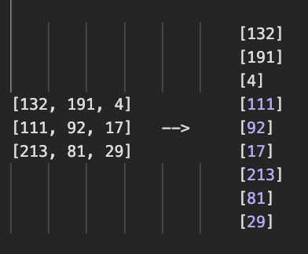
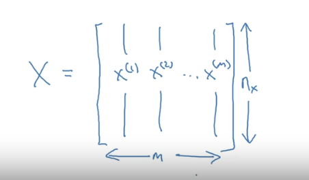

# Neural Network Basics | Week 2

> _I didn't take notes on Week 1, primarily due to lack of complexity_

## Binary Classification

A type of classification task where the classification is binary, meaning there are 2 choices, of which a sample is classified into 1.

If there were two classes within our dataset, 

1. Horse | 0
2. Zebra | 1

and a neural network was fed the following image:

The model would clasify it into one of two classes, hopefully it being the class represented by 1, the Zebra. (At least, it would if it was trained right lol.)

### RGB

Images, expressed through RGB, can be split into 3 different color channels corresponding to Red, Green, and Blue. 

Each corresponding color channel can be represented by matrices of same dimensions as the original image which holds pixel values between 0 to 255.

When these matrices are stacked on top of one another (in numpy, would use `np.vstack`), the full color image would be created.

### Feature Vectors & RGB

To input an image into a neural network, we typicall unroll the RGB pixel values into a singular feature vector.

For example, the color channel matrix for Red of an image with dimensionality, 3x3, would be unrolled into a feature vector of dimensitonality 9x1 each corresponding to values ranging from 0 to 255.

### Notation for the Course

- `(x,y)` is a specific training sample where,
    - `n(x)` is the total number of features per sample `x`
    - `x ∈ ℝ``n(x)`
    - `y ∈ {0, 1}`, given binary classification
- `m` is total number of training samples in a training sample where,
    - `{(x(1), y(1)), (x(2), y(2)),... (x(m), y(m))}` is a training set
    - May be written as `m_train` or `m_test`, for train and test samples respectively
- `X` is the matrix that holds the number of training samples and it's features.
    - `m` is the number of columns, indicating number of total samples
    - `n(x)` is the total number rows indicating total number of features.

        

    - In other cases, we might see conventions of using the transpose of the X matrix here (as I used in ["NNMNIST from scratch"](https://github.com/vxnuaj/np.mnistnn)). 
    
        Not using the transpose, and rather the convention used in this course makes the implementation of neural nets easier. 

    - In python, to check out the size of this matrix, when we run `X.shape` the result would be `(n(x), m)`

- `Y` is vector which holds the total amount of training labels for each sample in a dataset
    - `Y = [y(1), y(2),...y(m)]` 
    - The `Y.shape` will yield a dimensionality `(1,m)`

- `w` is the weight matrix, which is `∈ ℝ``n(x)`
    - There has to be one weight, `w` for each parameter `n(x)`, which is why it's an `∈ ℝ``n``x`

- `b` is the bias vector / matrix .

- `z` is the value of the weighted sum, `w``T``x + b`
    - The transpose is optional, contextual depending on the nature of the dataset

## Logistic Regression

**Logistic regression** is a learning algorithm when the output label(s) `Y` in a supervised learnign algorithm are all zero or one.

> _As a reminder, **supervised learning** is a type of machine learning that employs a labeled dataset to "teach" the algorithm to make a correct classification amongst different class labels._

Say we have a picture of a cat,

 | cat!

and a dataset where label `1` represents the cat class and label `0` represents the class, "not a cat"

In logistic regression, given `x`, we want `ŷ = P(y=1 | x)`, meaning we want to know that is the probability (`y`) that variable `x` correspondes to the class `1` (cat).

>_Essentially, according to our model, what would be the probability that the above picture is a cat?_

Params are `w` (weight) and `b` (bias).

We can't use traditional linear regression,
> `ŷ = w``T``x + b`

as when performing logistic regression, we want `ŷ` to be between 0 and 1 for a probability. Using linear regression can give us a value greater than 1 or a value less than 0.

> _**Reminder**: Linear regression is a means to predict the next value given a current (tangential) slope (think 6th grade mathematics). It serves as a means for prediction a the relationship when variables are completely linear_

Instead of using a pure linear model, logistic regression involes taking the linear regression. `ŷ =` `w``T``x + b`, and applying a sigmoid function to it.

>_**Reminder**: The transpose is optional, contextual depending on the nature of the dataset_

SIGMOID: `σ(z) = (1) / (1+e``-z``)`

 sigmoid function!

- If z is very large, then `σ(z)` will be nearing 1
- If z is very small, `σ(z)` will be nearing 0

In the earlier case, 

> `ŷ = P(y=1 | x)`
>
>_Essentially, according to our model, what would be the probability that the above picture is a cat?_

where the class for a cat is `1` and the input image **is** the image of a cat, using logistic regression, the model's job is to learn the optimal parameters `w` and `b` to output a 1.0 (100%) probability that the image belongs to class `1` (cat)

> **NOTE** _Will be using katex styling from now, instead of `code` styling_

So essentially given a training set, $[(x^1, y^1),...,(x^m, y^m)]$, you want $\hat{y}≈ y^i$

#### Logistic Regression Cost Function

A common loss function typically used in linear regression is the squared error, $(y - \hat{y})^2$. In logistic regression we can't use this as it introduces an optimization problem. Where logistic regression isn't linear, the loss function will have local minima. Using the squared error doesn't allow for a network to optimize it's weights past those local minima to a global minima.

The loss function for logistic regression is typically, 

$ L(\hat{y}, y) - ylog{\hat{y}} + (1-y)log(1-\hat{y})$ | Called the cross-entropy loss

Here, if $y=1$, we get $-log(\hat{y})$. To minimize the loss, we want $\hat{y}$ to be as big as small as possible or nearing 1 given that 0 ≤ $\hat{y}$ ≤ 1 due to the sigmoid activation function.

Then, if $y=0$, we get $-log(1-\hat{y})$. To minimize the loss, we want $\hat{y}$ to be as small as possible or nearing 0 given that 0 ≤ $\hat{y}$ ≤ 1 due to the sigmoid activation function.

The the cost function can be defined as the average of the loss function over all datapoints $i$,

$\frac{1}{m} \sum_{i=1}^{m} - y^ilog{\hat{y}^i} + (1-y^i)log(1-\hat{y}^i)$

$\frac{1}{m} \sum_{i=1}^{m} L(\hat{y}^i, y^i)$

The loss function is the loss of 1 parameter, whilst the cost function is the averaged loss of all parameters.

Ultimately, logistic regression can be seen as a mini-neural network. Logistic regression computed on a single datapoint can be considered a neuron of a neural network!

>**Note**: For the full math, check [here](/Artificial-Intelligence/Machine-Learning/Logistic-Regression/logregmath.md)

## Gradient Descent
