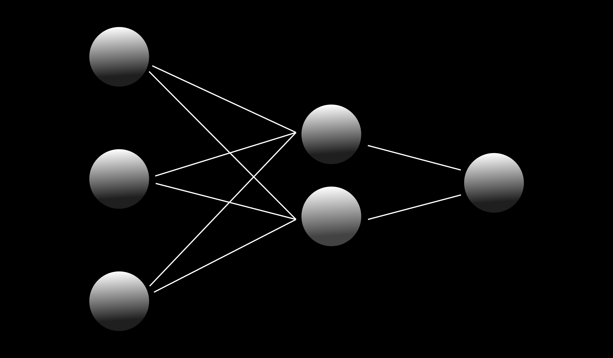

## A Look at Forward Propagation in Terms of Linear Algebra

> _For only a single training / test sample!_

Let's consider a simple network:

 

1. The input layer consists of 3 input features or input neurons, $x^{[i]}$.
2. The first hidden layer consists of 2 neurons, $n_1^{i}$
3. The output layer consists of a single neuron $n_2^{1}$

where $i$ is the index of a specific neuron. The subscript is the index of the current layer.

The inputs, $x^{[i]}$, are represented by column vector $X$

$X = \begin{pmatrix} x_1^{[1]} \\ x_1^{[2]} \\ x_1^{[3]}\end{pmatrix}$

> For $x$, the superscript is the index of each neuron and the subscript is the index of each input sample.

Then given the size of our input vector $X$ and the number of neurons, $n$, the weights for our first hidden layer are defined by a matrix with the shape $(2, 3)$, where the rows $(2)$ are the number of neurons in the first hidden layer and the columns $(3)$ are the number of input features.

This weights matrix is defined as $W_{[1]}$, the subscript $1$ indicating the first hidden layer, where:

$ W_{[1]} = \begin{pmatrix} w_{11}^{1}, w_{12}^{1}, w_{13}^{1} \\  w_{11}^{2}, w_{12}^{2}, w_{13}^{2} \end{pmatrix}$

> Each $w$ has subscripts representing the given index and the given layer. The first number is the current layer and the second number is the current weight parameter. The superscript is the index of each neuron. Similar notation will apply for the rest of the computations.

To begin the forward propagation, you take can take the input matrix $X$ and apply a matrix multiplication, with column vector $X$

>**np.dot(W, X)**

$ Z_{[1]} = \begin{pmatrix} w_{11}^{1}, w_{12}^{1}, w_{13}^{1} \\ w_{11}^{2}, w_{12}^{2}, w_{13}^{2} \end{pmatrix} · \begin{pmatrix} x^{[1]} \\ x^{[2]}\\ x^{[3]} \end{pmatrix}$

$ Z_{[1]} = \begin{pmatrix} w_{11}^{1}x^{[1]} + w_{12}^{1}x^{[2]} + w_{13}^{1}x^{[3]} \\  w_{11}^{2}x^{[1]} + w_{12}^{2}x^{[2]} + w_{13}^{2}x^{[2]} \end{pmatrix}$

$ Z_{[1]} = \begin{pmatrix} z_1^1 \\  z_1^2 \end{pmatrix}$

Here, $Z$ is our weighted sum matrix for the $1st$ hidden layer.

Then we can take a bias vector $B$, and element-wise add each bias to each $z_1^i$.

$ Z_{[1]} = \begin{pmatrix} z_1^1 \\  z_1^2 \end{pmatrix} + \begin{pmatrix} b_{1}^1 \\ b_{1}^2 \end{pmatrix}$

Afterward, we apply the sigmoid function to each element in the matrix $Z_{[1]}$ for the activations in the current layer.

$A_{[1]} = \begin{pmatrix} σ(z_1^1) \\ σ(z_1^2) \end{pmatrix}$

$A_{[1] }= \begin{pmatrix} a_{1}^{1} \\  a_{1}^{2} \end{pmatrix}$

The matrix $A_{[1]}$ represents the output for each of our 2 neurons in our first hidden layer!

To get the final output / prediction of this mini neural network, we apply another matrix multiplication of weights with the activations, $A_{[1]}$

Given that our output layer only has 1 neuron, we use a weights matrix (well vector) of:

$W_{[2]} = \begin{pmatrix} w_{21}^1, w_{21}^1 \end{pmatrix}$

So we do a matrix multiplication:

 $ Z_{[2]} = \begin{pmatrix} w_{21}^1a_{1}^{1} + w_{21}^1a_{1}^{2} \end{pmatrix}$

 $Z_{[2]} = (z_{21}^1)$

Then add a bias once again, this time only 1 given that our output layer consists of 1 neuron

 $Z_{[2]} = (z_{21}^1) + (b_{21}^1)$

Then we can apply a sigmoig activation function (or in some cases softmax) to get our final prediction / output:

$A_{[2]} = \begin{pmatrix} σ(z_{21}^1)\end{pmatrix}$

$A_{[2] }= \begin{pmatrix} a_{21}^{1}\end{pmatrix}$

And that's the final output for our very simple neural network, for only 1 sample.

We can do something very similar for multiple samples.

Say we have a matrix $X$ of 2 samples:

$X = \begin{pmatrix} x_{1}^{1}, x_{2}^{1} \\ x_{1}^{2}, x_{2}^{2} \\ x_{1}^{3}, x_{2}^{3} \end{pmatrix}$

> _Here, the superscripts represent a neuron / input feature, $i$, and the subscripts represent the index of each sample._

where the rows are the number of features per sample and the columns are the total samples. $(3,2)$.

So we have 2 samples and each sample has 3 features.

We can forward propagate the input matrix $X$ as:

$X · W_1$

> _We're using the previous weight matrix of dimensions (2,3)_

$ Z_1 = \begin{pmatrix} w_{11}^{1}, w_{12}^{1}, w_{13}^{1} \\  w_{11}^{2}, w_{12}^{2}, w_{13}^{2} \end{pmatrix} · \begin{pmatrix} x_1^{[1]}, x_2^{[1]} \\ x_1^{[2]}, x_2^{[2]} \\ x_1^{[3]}, x_2^{[3]}\end{pmatrix}$

$ Z_1 = \begin{pmatrix} w_{11}^{1}x_1^{[1]} + w_{12}^{1}x_1^{[2]} + w_{13}^{1}x_1^{[3]}, w_{11}^{1}x_2^{[1]} + w_{12}^{1}x_2^{[2]} + w_{13}^{1}x_2^{[3]}  \\  w_{11}^{2}x_1^{[1]} + w_{12}^{2}x_1^{[2]} + w_{13}^{2}x_1^{[2]}, w_{11}^{1}x_2^{[1]} + w_{12}^{1}x_2^{[2]} + w_{13}^{1}x_2^{[3]} \end{pmatrix}$

$ Z_1 = \begin{pmatrix} z_{11}^1, z_{12}^1 \\ z_{11}^2, z_{12}^2\end{pmatrix} $

> _This might get a little confusing so here's the notation again:_
>
>_For every $z$ in $Z$:_
> 
>_The superscript is the index of a given neuron_
>
>_The first number in the subscript is the current layer._
>
>_The second number in the subscript is the index per sample._

Then ultimately, you'd apply the addition of the bias matrix, $B$, and the sigmoid function, σ, to get the activation matrix $A$ which would look as:

$A_{[1] }= \begin{pmatrix} a_{11}^{1}, a_{12}^{1} \\\  a_{11}^{2}, a_{12}^{2}\end{pmatrix}$

You can then propagate this forward by another matrix multiplication with matrix, $W_2$, another addition to with bias matrix, $B_2$, and finally apply a sigmoid activation function to get matrix $A_2$ which holds your final activations/predictions with dimensions $(1,2)$ where 1 is the number of output neurons and 2 is the total samples [^1].

[^1]: Of course, in a real dataset, you'd have more than 2 samples and most definitely way more features.

