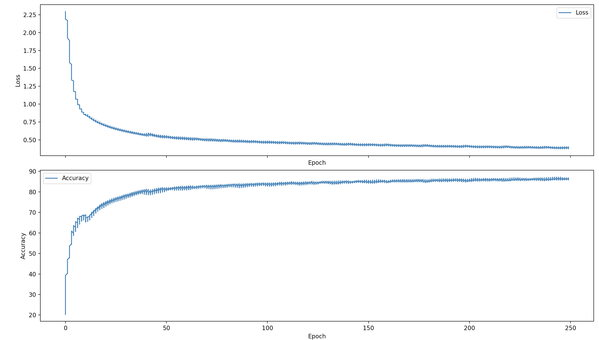
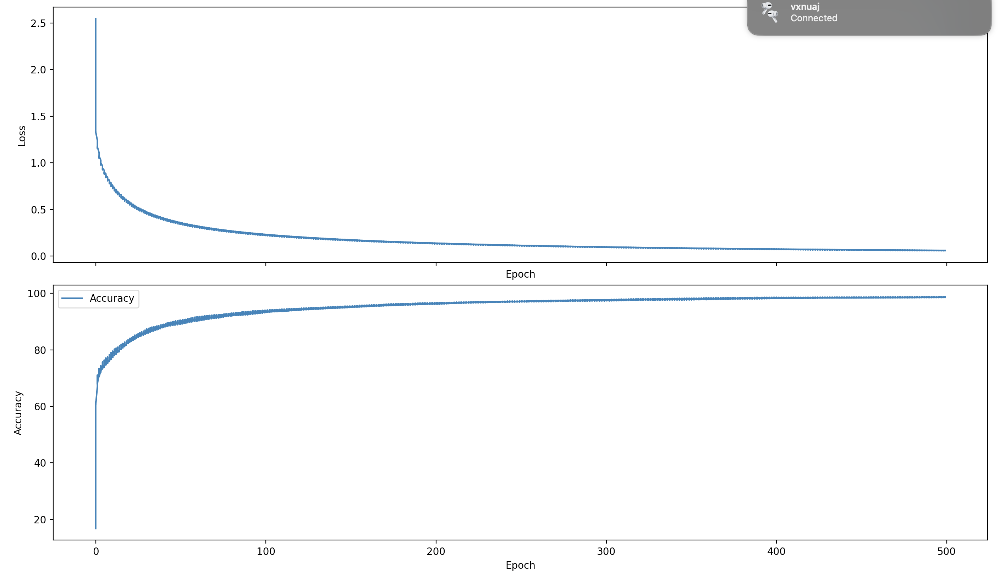
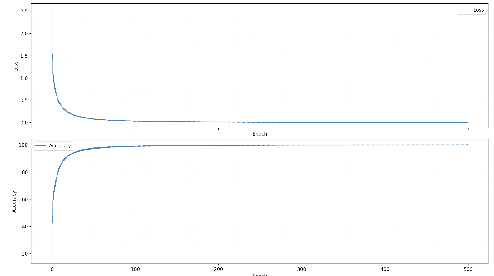
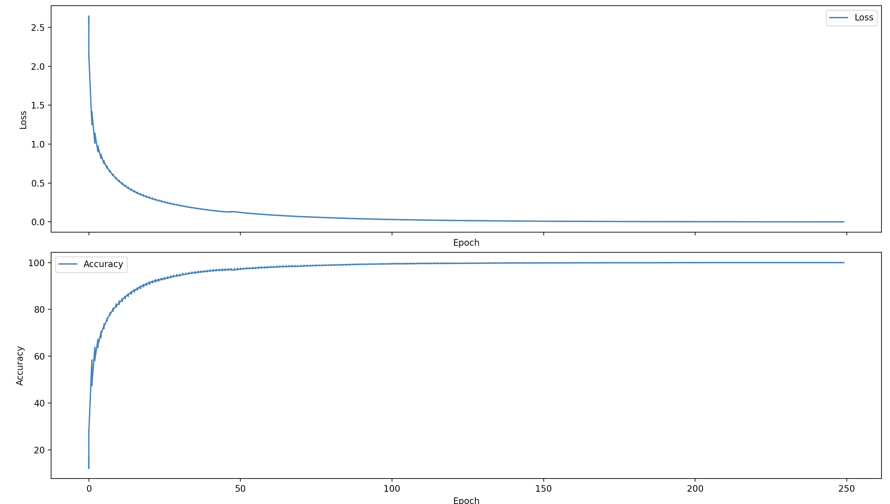
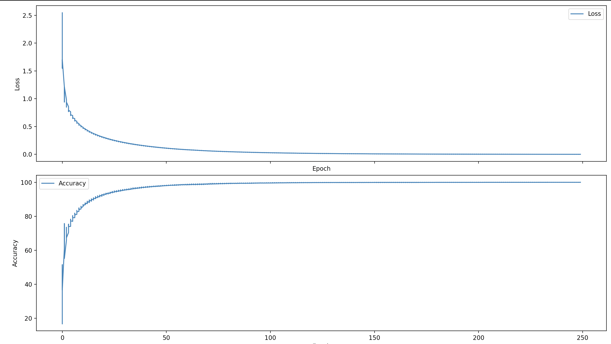
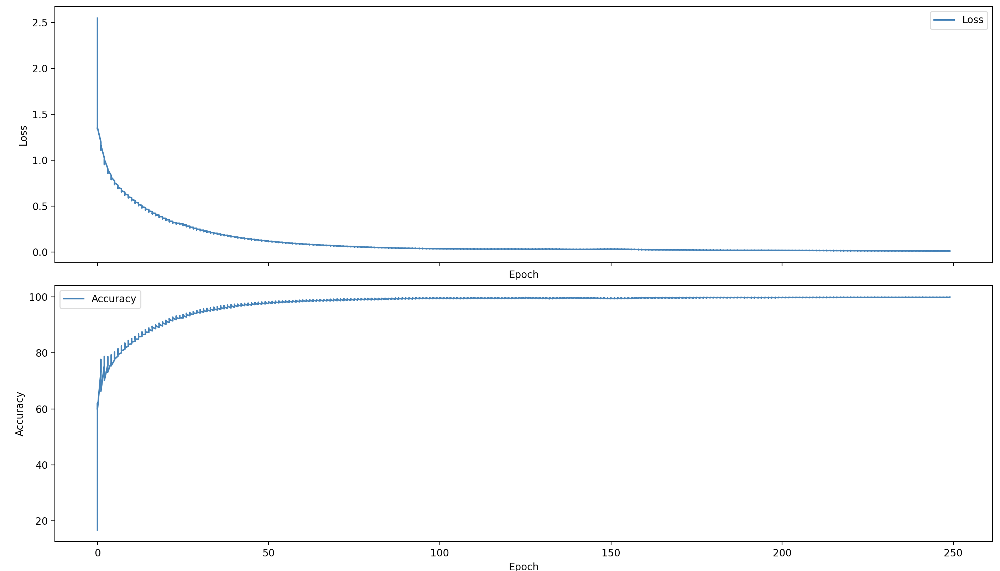
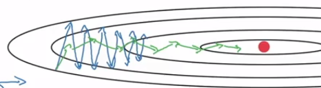
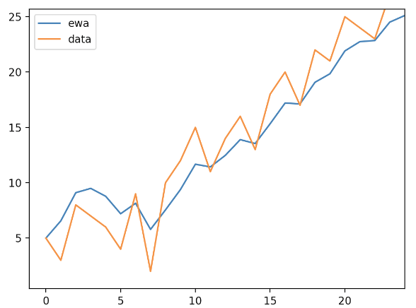

## Testing the speed of BatchNormalization on Varying Models

Here, I compare the effect that BatchNormalization has in terms of training speed accross a variety of models each with different optimization algorithms.

I was curious to figure out, *what are the limtis to how fast I can train a neural network?*

Each model was run for either **250 or 500 epochs**, therefore each model was run for **2500 or 5000** training steps given the mini-batch size.

`Mini_BatchNormNN.py` is Vanilla BatchNorm, on a neural network trained on FashionMNIST with 10 minibatches, each batch totaling to 6k samples each.

`RMSMini_BatchNormNN.py` is BatchNorm with RMSprop, again on a neural network trained on FashionMNIST with 10 minibataches, each sample totaling to 6k samples each.

`AdamMini_BatchNormNN.py` is BathcNorm is Adam, again on a neural network trained on FashionMNIST with 10 minibataches, each sample totaling to 6k samples each.

`AdamMaxMiniBatchNormNN.py` is BathcNorm is Adam, again on a neural network trained on FashionMNIST with 10 minibataches, each sample totaling to 6k samples each.

`BatchNormNN.py` is a Minibatched model wtih no batchnorm, again on a neural network trained on FashionMNIST with 10 minibataches, each sample totaling to 6k samples each.

> _More details under their corresponding sections_  
> *Set `np.random.default_rng(seed = 1)` for reproducible results*
>

## Results

### [`MiniBatchNN.py`](MiniBatchNN.py)

**Epochs:** $250$  **Learning Rate:** $.1$<

**Final Accuracy:** $86.4333333333332$ **Final Loss:** $0.3872550181735683$

> *Defintely less faster than BatchNorm*

### [`Mini_BatchNormNN.py`](Mini_BatchNormNN.py)

**Epochs**: $250$ **Learning Rate ($\alpha$):** $.1$

**Final Accuracy:** $98.77$%

> _Comments: Did not expect Batch Normalization to be this effective... prior when training using mini-batches, my training would struggle to even near the % or loss when training in full batches. This exceeded my expectations, but now I'm excited to train the same model with adaptive learning rates (RMSprop)._

**Epochs**: $500$ **Learning Rate ($\alpha$)**: $.05$

**Final Accuracy:** $max(99.95)$, true final: $99.91666$%

### [`RMSMini_BatchNormNN.py`](RMSMini_BatchNormNN.py)

**Epochs**: $250$ **Learning Rate ($\alpha$):** $.01$ **Learning Rate Adap. ($\beta$):** $.99$

**Final Accuracy**: $100.0$ (or about 99.99999 if we wanna be exact.) **Final Loss:** $0.0010182603008388811$

>*Comments: ts is crazy. I'm reached 99% accuracy at about ~120 epochs, i believe. More excited to apply Adam now. Next CIFAR-10 as well.*

### [`AdamMini_BatchNormNN.py`](AdamMini_BatchNormNN.py)

**Epochs:** $250$  **Learning Rate:** $.05$ **Momentum ($\beta_1$): $.9$** **Learning Rate Adap. ($\beta_2$): $.99$**

**Final Accuracy:** $100.0$, rounded. Probably in reality $99.9999999$ -> $\infty$ **Final Loss:** $0.0009990290433655625$

### [`AdamMaxMiniBatchNormNN.py`](AdaMaxMiniBatchNormNN.py)

**Epochs:** $250$  **Learning Rate:** $.1$ **Momentum ($\beta_1$): $.9$** **Learning Rate Adap. ($\beta_2$): $.99$**

**Final Accuracy:** $99.9$ **Final Loss:** $ 0.011298599323742314$

## Explanation

Taking the base model, `MiniBatchNN.py`, it reached an accuracy of ~86.4% with a loss of ~.3872.

> *This model was a pure vanilla neural network with no additional techniques (i.e., regularization, altered optimzation algs, or normalization in the intermediate layers) to optimize for better accuracy, besides being fed Mini Bat ches of samples (6k in size, 10 total), as was every other model*.

An observastion I see in the accurcy:epoch and loss:epoch curve is the presence of vertical oscillations, indicating the lack of smooth training.

While this might be due to a large learning rate, if I decreased the learning rate on the logarithmic scale (say to $.01$ or $.001$), training the model would've been slower and may not have even reached the 86% accuracy within the same timeframe.

Yet of course, the presence of vertical oscillations indicate a suboptimal learning path which then indicates that optimizing this path, whilst maintaining a learning rate on the same order, would yield better results in a shorter amount of time.

This will be addressed with RMSprop, Adam, and AdaGrad, but for now let's focus on the BatchNormalization

### BatchNorm

In `MiniBatchNN.py`, it was observed that after 100 training epochs or 1000 iterations, the average of the gradients, $\frac{∂L}{∂W_2}$, was at a value of 1.198043400596483e-20 or $0.00000000000000000001198043400596483$ on an extremely small scale.

This is likely due to an issue of vanishing gradients, and while the model was still able to train effectively, just as the prior scenario where further optimization can benefit, the same applies here. Attepmting to mitigate these small gradients that then end up propagating through the model can yield benefit to faster training speeds.

Batch Normalization as posed in the original paper aims to reduce the internal covariate shift, meaning the shift of distribution in inputs $Z_l$ to a given activation function at layer $l$. 

Mitigating this internal covariate shift involves normalizing the inputs $Z_l$ to each activation function at each layer $l$.

This is done through a z-score normalization, defined as:

$\mu = \frac{1}{m} \sum_{i=1}^m x_i$

$var = \sigma^2 = \frac{1}{m} \sum_{i = 1}^m (x_i - \mu)^2$ 

$x = \frac{x - \mu}{\sqrt{var}}$

In a subsequent layer, an linear transformation, with learnable parameters $\beta$ and $\gamma$ is then applied. 

The $\beta$ (shifts the mean) and $\gamma$ (alters the variance) allows for a shift of the $\mu$ and $var$ of the inputs as needed for the model.

The model is primed to learn these optimal parameters, thereby learning the optimal mean and variance of inputs $Z_l$ to a given layer.

So, in the model, where BatchNorm was implemented (`Mini_BatchNormNN.py`), this normalization process was defined as:

$Z_1 = W_1 \cdot X$

$Z_{1norm} = batchnorm(Z_1)$

$\tilde{Z_{1norm}}= \gamma_1 \cdot Z_{1norm} - \beta_1$

$A_1 = Leaky_{ReLU}(\tilde{Z_{1norm}})$

$Z_2 = W_2 \cdot A_1$

$Z_{2norm} = batchnorm(Z_2)$

$\tilde{Z_{2norm}}= \gamma_2 \cdot Z_{2norm} - \beta_2$

$A_2 = Softmax(\tilde{Z_{2norm}})$

Ultimately, when training the model, `Mini_BatchNormNN.py`, the averaged gradients over 100 epochs, $\frac{∂L}{∂W_2}$, turnt out to be 0.000379726866150545 effectively mitigating the effect that the tiny gradient in layer $2$ had in the base model. 

The case for this may be due to the fact that each layer inputs are normalized accordingly, thereby the scale of gradients is normalized accordingly as well.

> _The accuracy in the base model was lower when compared to the BatchNorm model at this point, so the smaller gradientes weren't due to converging on the optima_

This then has the potential to speed up training given that the gradients are more reprsentable at a normalized scale. 

The model won't have to adjust it's parameters to an ever adjusting distribution of inputs $Z_l$ (mitigating covariate shift), and instead learns according to a normalized scale, thereby making training easier and faster with smaller complexity.

And this then was the case empirically which can be seen in the [former section](#Results), where implementing Batch Normalization had about a ~12% increase in training accuracy compared to the base model.

### RMSprop, Adam, AdaMax

As mentioned earlier, *"An observastion I see in the accurcy:epoch and loss:epoch curve is the presence of vertical oscillations, indicating the lack of smooth training."*

This was more of an extreme case in `MiniBatchNN.py`, but was reduced in the Batch Normalized model, `Mini_BatchNormNN.py`. 

Despite this, there still was a type of oscillation in the training curves.

This type of oscillation indicates that the training curve can be further smoothed out in an optimal direction to then accelerate the training speed.

Using this image as an example, for intuition, the blue zig-zag can explain an unoptimized training curve, where a set of parameters $\theta$ and their gradients with respect to the loss, $\frac{∂L(\theta)}{∂\theta}$, oscillate wildly as a model attempts to find the optima of the surface of the loss (represented by the red dot)

It'd be ideal to optimize the learning curve to approximate a more stable path such as the green line in the image above.

Essentially, this is what the optimzation algorithms, RMSprop, Adam, and AdaMax aim to do, in varying ways.

Looking purely at RMSprop, it acts as a form of adapting the learning rate , where the learning rate, $\alpha$, decreases as the exponentially weighted average of the gradients squared, gets larger.

>*In essence, the bigger your gradients are, the smaller $\alpha$ becomes.*  
>
>*This exponentially weighted average, for a given $\theta$ is computed through the following equation:*
>
> $E[\tilde{g}_t^2] = (\beta * E[\tilde{g}_{t - 1}^2]) + (1 - \beta) * g_t^2$ 
>
> *where $\tilde{g}_t^2$ (or $\tilde{\frac{∂L(\theta)}{∂\theta}}_t$) is the exponentially weighted squared gradient at iteration $t$ and $g_t$ (or $\frac{∂L(\theta)}{∂\theta}$) is the gradient at iteration $t$.*
>
>*The computation of the exponentially weighted average is used to scale the learning rate as, $\frac{\alpha}{\sqrt{E[\tilde{g}_t^2]}}$, which then fits into the weight update as:*
>
>$\theta = \theta - \frac{\alpha}{\sqrt{E[\tilde{g}_t^2]}} * \frac{∂L{\theta}}{∂\theta}$
>
>*Again, as $\sqrt{E[\tilde{g}_t^2]}$ gets bigger, $\alpha$ becomes smaller, then reducing the size of the training step.*

Adding this adpative term to the learning rate, reduces the vertical oscillations, particularly in the regions where we saw more vertical oscillation.

This is as in those regions, the earlier stasges of training, our gradient was larger, therefore the $E[\tilde{g}_t]$ grows larger, then the learning rate, $\alpha$, decreases in magnitude.

This small improvement was able to bump up the training accuracy by about ~1.2% to about an estimated $99.9999999$ in a mere 250 epochs or 2500 training steps.

>*It appeared as 100% in the terminal, but that's just NumPy's rounding of the $.999999999$*

Adam and AdaMax have a similar philosophy, though not exactly the same, when optimizing the learning curve.

> *I'd say Adam / AdaMax are improvements on RMSprop*

Adam, makes use of the  adaptive learning rate, jsut as RMSprop does, but with an added momentum to the gradients, then further affecting the weight update.

Just as prior, it computes the exponentially weighted averages of the squared gradients:

$E[\tilde{g}_t^2] = (\beta * \tilde{g}_{t - 1}) + (1 - \beta) * g_t^2$ 

> *This is known as the second moment*

but then also computes the exponentially weighted averages of the gradients (non-squared):

$E[\tilde{g}_t] = (\beta * E[\tilde{g}_{t - 1}]) + (1 - \beta) * g_t$ 

>*This is known as the first moment*

This *first moment, $E[\tilde{g}_t]$*, is then used to replace the original gradient in the weight update at a current iteration step $t$, which adds the effect of momentum.

In essence, the first moment accumulates and averages the magnitudes of the past gradients along with the magnitude of the gradient at current iteration step, $t.$ 

This type of averaging allows for the neural network to average the gradients accross multiple iterations, ultimately smoothing out the effect it has on the weight update.

For more intuition, here's what taking the exponentially weighted average looks like:

The blue line represents the exponetially averaged datapoints, indicating more smooth gradients over time, while the orange line indicates the original gradients over time.

We get smoother line the larger $\beta$ becomes.

Ultimately, then Adam, the first moment in combination with the second moment, should provide an optimized learning curve and faster learning speeds similar to, if not better than RMSprop.

AdaMax, should then also provide a similar effect, given that it builds on the concept of Adam, but rather, for the *second moment*, than taking the exponentially weighted averages of gradient $g_t^2$, it takes the exponentially weighted averages of a gradient, $g_t$ raised to the $pth$ power, where $p$ is equivalent to iteration $t$.

$v_t = \beta_2(v_{t-1} + (1 - \beta_2)(\frac{∂J(\theta)}{∂\theta})^2$

Empirically, both AdaMax and Adam acheived faster results than a vanilla network, both nearing $99.99999$% accuracy as seen in the prior section in a lower amount of epochs.

