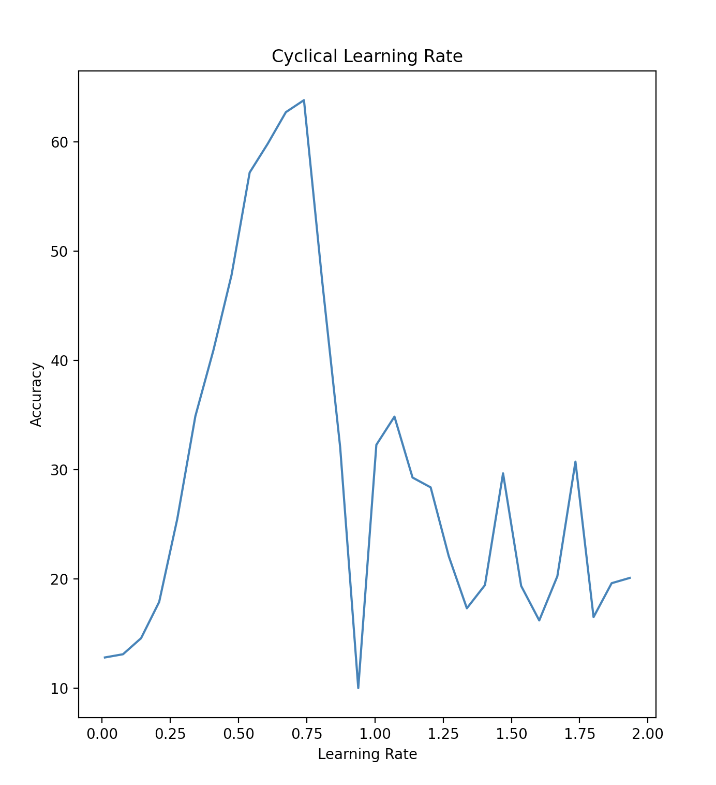
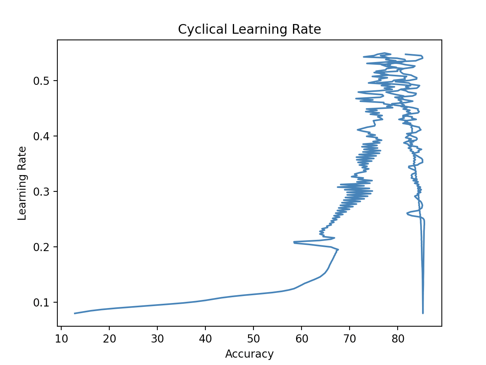
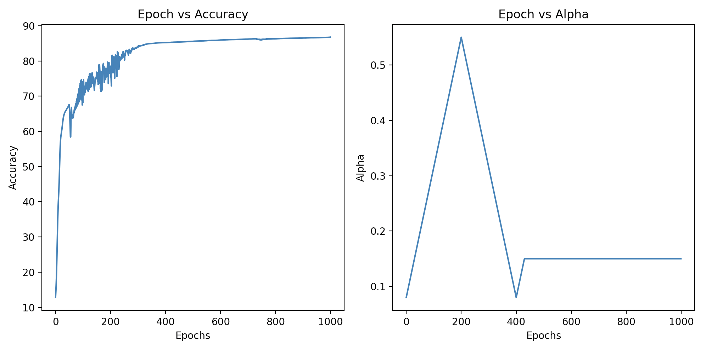
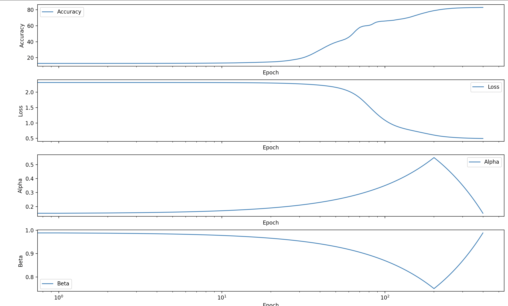
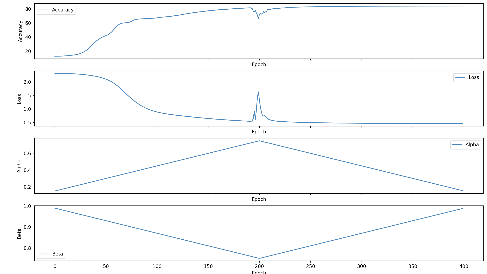
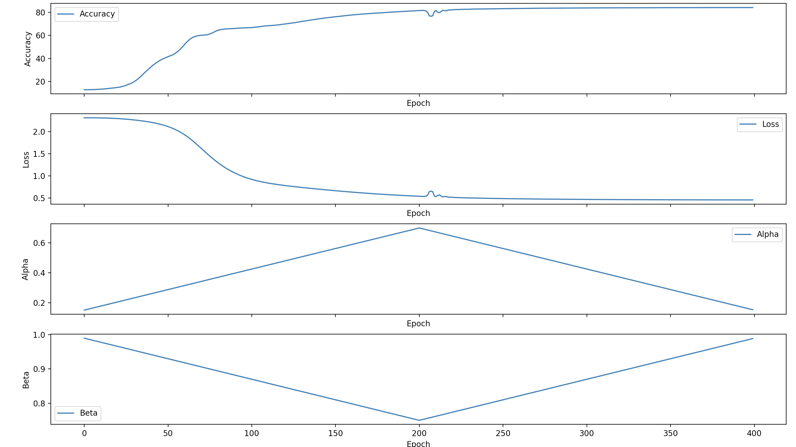
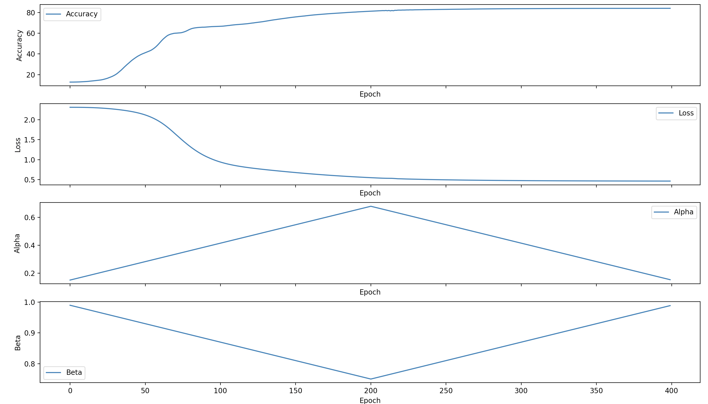
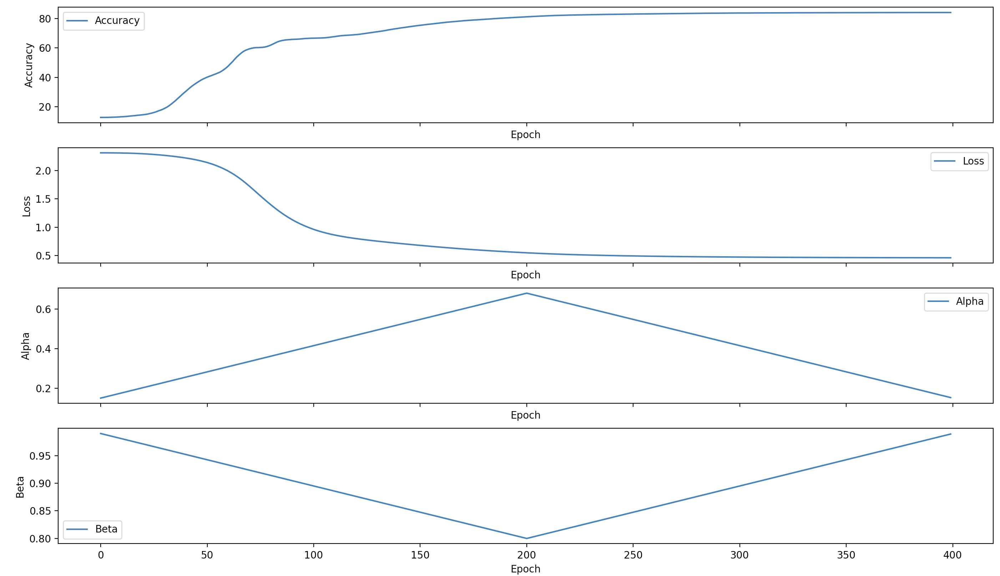
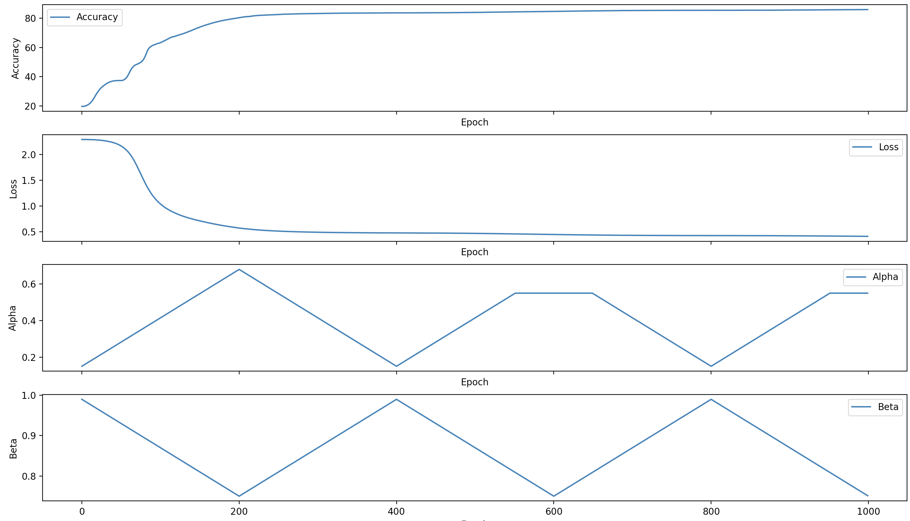

### Optimizing the Learning Rate Scheduling

<details><summary>idea</summary>

do a write up and ship it as a blog post? + other notes you took on learning rate scheduling and the superconvergence paper?

</details>


Finding the optimal learning rate was done using `OptLR.py` using experimental minimum and maximum bounds for a set cycle size.

>_This is more of an experimental test for learning purposes. The effect won't be the same as complex models given the simple nature of this model. 32 / 64 hidden weights, on the FashionMnist_

> _Don't know much about grid search, but using the cyclical learning rate seems to be a good means to find the maximum learning rate, and estimate the optimal learning rate as well._

The maximum learning rate prior to a decrase in accuracy was then found to be located at `.7396` when oscillating over cycle of 30 epochs.



When testing the model (`OptNN.py`) on this maximum value (`.55`), the loss and accuracy seemed to oscillate all over the place at the beginning, but then ended up converging to a relatively symmetric accuracy as the vanilla model, `NN.py` up until about 200 Epochs at which the model seemed to struggle to find the global minima given the higher learning rate.

> _Note: `NN.py` reaches about ~78% accuracy after 250 epochs, at which the model would need to converge onto a more precise set of parameters to continue increase training accuracy. This then indicates the need for a smaller learning rate to allow for more precision._ 

>_This may correlate with why `OptNN.py` struggled after a relatively similar # of epochs with a high learning rate._

The model was likely struggling to find the learning path in the former stages of training whilst overshooting once it got to the latter stages. The higher learning rate seemed to help during the middle stages of training.

>_It's difficult to tell without being able to plot the surface of the loss, but that's what I can conjecture_

> _In accordance to the paper ["Super-Convergence: Very Fast Training of Neural Networks Using Large Learning Rates"](https://arxiv.org/pdf/1708.07120), this seems to denote the importance of minizming the learning rate once we get to the latter stages of training in order to allow for the model to fully converge onto the global optima with precision and without overeshooting_

It was later found that when using a cycle-size of `200`, the maximum learning rate was at a value of `.55`. Training on oscillations between a min learning rate of `.08` and `.55` yielded about ~85% accuracy after 350 epochs, though when cycling back up to the learning rate of `.55` after nearing 85% accuracy at 400 epochs, the accuracy began to oscillate as well as the loss indicating a need for a smaller learning rate in the latter stages of training.

This type of oscillation when nearing the `.55` learning rate was not present in the middle stages of training (at about 150 - 250) likely due to less of a need for precision in training steps given that the model wasn't fully fitting to the dataset as of yet.



> _As can be seen, the model plateaud in accuracy at about 85% at a learning rate of .08 (this was at about 400-450 epochs)_

<details>

```
Epoch: 472
Loss: 0.41238470859011184
Acc: 85.465
Alpha: 0.24919999999999998
Epoch: 473
Loss: 0.4163917592896523
Acc: 85.26
Alpha: 0.2515500000000001
Epoch: 474
Loss: 0.4306116036464412
Acc: 84.72
Alpha: 0.25390000000000007
Epoch: 475
Loss: 0.4567344888361776
Acc: 82.94333333333334
Alpha: 0.25625000000000003
Epoch: 476
Loss: 0.5420431350228672
Acc: 82.10499999999999
Alpha: 0.25859999999999994
Epoch: 477
Loss: 0.4756733595924713
Acc: 81.94
Alpha: 0.2609499999999999
Epoch: 478
Loss: 0.486175691045095
Acc: 82.66
Alpha: 0.2633000000000001
Epoch: 479
Loss: 0.44068178219330467
Acc: 84.24833333333333
Alpha: 0.26565
Epoch: 480
Loss: 0.4320439076697191
Acc: 84.59
Alpha: 0.26799999999999996
Epoch: 481
Loss: 0.4250124298377447
Acc: 85.005
Alpha: 0.2703499999999999
Epoch: 482
Loss: 0.42298520930803946
Acc: 85.06333333333333
Alpha: 0.27270000000000005
Epoch: 483
Loss: 0.42173792618578954
Acc: 85.13
Alpha: 0.27505
Epoch: 484
Loss: 0.4227421760813842
Acc: 85.05333333333334
Alpha: 0.2774
Epoch: 485
Loss: 0.4241986783465347
Acc: 84.94
Alpha: 0.27974999999999994
Epoch: 486
Loss: 0.42929942495854867
Acc: 84.76
Alpha: 0.2821000000000001
Epoch: 487
Loss: 0.4332402021708844
Acc: 84.38166666666666
Alpha: 0.28445000000000004
Epoch: 488
Loss: 0.44580883700922197
Acc: 84.09
Alpha: 0.2868
Epoch: 489
Loss: 0.44395684148388975
Acc: 83.785
Alpha: 0.28914999999999996
Epoch: 490
Loss: 0.4587420528394233
Acc: 83.53666666666668
Alpha: 0.2915000000000001
Epoch: 491
Loss: 0.4386277036639038
Acc: 84.135
Alpha: 0.29385000000000006
Epoch: 492
Loss: 0.4438470929125106
Acc: 84.09333333333333
Alpha: 0.2962
Epoch: 493
Loss: 0.4282221660377757
Acc: 84.77333333333334
Alpha: 0.2985499999999999
Epoch: 494
Loss: 0.4319738340612923
Acc: 84.52333333333333
Alpha: 0.3009000000000001
Epoch: 495
Loss: 0.42458965302728324
Acc: 84.885
Alpha: 0.3032500000000001
Epoch: 496
Loss: 0.4317085339565026
Acc: 84.50833333333333
Alpha: 0.3056
Epoch: 497
Loss: 0.4265392430612543
Acc: 84.71333333333332
Alpha: 0.30794999999999995
Epoch: 498
Loss: 0.4395467569674661
Acc: 84.06333333333333
Alpha: 0.31030000000000013
Epoch: 499
Loss: 0.4314652308956462
Acc: 84.37333333333333
Alpha: 0.31265000000000004
Epoch: 500
Loss: 0.4496873573555622
Acc: 83.50166666666667
Alpha: 0.315
Epoch: 501
Loss: 0.4357163818838014
Acc: 84.24000000000001
Alpha: 0.31734999999999997
Epoch: 502
Loss: 0.4526482084069671
Acc: 83.20833333333333
Alpha: 0.31969999999999993
Epoch: 503
Loss: 0.44322827751730653
Acc: 83.70333333333333
Alpha: 0.32205000000000006
Epoch: 504
Loss: 0.4584468805608181
Acc: 82.83166666666666
Alpha: 0.3244
Epoch: 505
Loss: 0.4563584592179008
Acc: 83.00166666666667
Alpha: 0.32675
Epoch: 506
Loss: 0.463172374268046
Acc: 82.83
Alpha: 0.32909999999999995
Epoch: 507
Loss: 0.4525705354122329
Acc: 83.025
Alpha: 0.3314500000000001
Epoch: 508
Loss: 0.44821244277386957
Acc: 83.755
Alpha: 0.33380000000000004
Epoch: 509
Loss: 0.4432220937005146
Acc: 83.765
Alpha: 0.33615
Epoch: 510
Loss: 0.45206584968397134
Acc: 83.555
Alpha: 0.33849999999999997
Epoch: 511
Loss: 0.46610227430311024
Acc: 82.85833333333333
Alpha: 0.3408500000000001
Epoch: 512
Loss: 0.47543232412615144
Acc: 82.28833333333333
Alpha: 0.34320000000000006
Epoch: 513
Loss: 0.492408388526685
Acc: 82.32000000000001
Alpha: 0.34555
Epoch: 514
Loss: 0.4433368445702059
Acc: 84.11333333333333
Alpha: 0.34789999999999993
Epoch: 515
Loss: 0.43255406156375514
Acc: 84.49333333333333
Alpha: 0.3502500000000001
Epoch: 516
Loss: 0.4215369541110301
Acc: 85.165
Alpha: 0.3526000000000001
Epoch: 517
Loss: 0.4202494800996882
Acc: 85.14166666666667
Alpha: 0.35495000000000004
Epoch: 518
Loss: 0.4191983676124606
Acc: 85.15333333333334
Alpha: 0.35729999999999995
Epoch: 519
Loss: 0.42414787801054166
Acc: 84.95833333333334
Alpha: 0.35965000000000014
Epoch: 520
Loss: 0.4287259140862987
Acc: 84.48
Alpha: 0.3620000000000001
Epoch: 521
Loss: 0.44576317681736594
Acc: 84.045
Alpha: 0.36435
Epoch: 522
Loss: 0.4460433542171543
Acc: 83.52166666666668
Alpha: 0.36669999999999997
Epoch: 523
Loss: 0.4649278194569159
Acc: 83.31166666666667
Alpha: 0.36905000000000016
Epoch: 524
Loss: 0.433718612256456
Acc: 84.42166666666667
Alpha: 0.37140000000000006
Epoch: 525
Loss: 0.43559592787998086
Acc: 84.26333333333334
Alpha: 0.37375
Epoch: 526
Loss: 0.4228619516930901
Acc: 84.93833333333333
Alpha: 0.3761
Epoch: 527
Loss: 0.43573120146553374
Acc: 84.02833333333334
Alpha: 0.37844999999999995
Epoch: 528
Loss: 0.43722656562378726
Acc: 84.08666666666666
Alpha: 0.3808000000000001
Epoch: 529
Loss: 0.4738673843757155
Acc: 82.25333333333333
Alpha: 0.38315000000000005
Epoch: 530
Loss: 0.4749823962383235
Acc: 82.13000000000001
Alpha: 0.3855
Epoch: 531
Loss: 0.4880551834144913
Acc: 81.26833333333333
Alpha: 0.3878499999999999
Epoch: 532
Loss: 0.47118839265656814
Acc: 81.85166666666667
Alpha: 0.3902000000000001
Epoch: 533
Loss: 0.4426221100652135
Acc: 83.79333333333334
Alpha: 0.39255000000000007
Epoch: 534
Loss: 0.4383883926903927
Acc: 84.03500000000001
Alpha: 0.39490000000000003
Epoch: 535
Loss: 0.4416314634204303
Acc: 83.87
Alpha: 0.39724999999999994
Epoch: 536
Loss: 0.460235737329413
Acc: 83.10499999999999
Alpha: 0.3996000000000001
Epoch: 537
Loss: 0.4732631374185501
Acc: 82.50333333333333
Alpha: 0.4019500000000001
Epoch: 538
Loss: 0.4969686246743229
Acc: 81.865
Alpha: 0.4043
Epoch: 539
Loss: 0.45248027345432607
Acc: 83.8
Alpha: 0.40664999999999996
Epoch: 540
Loss: 0.4384646119111253
Acc: 84.2
Alpha: 0.40900000000000014
Epoch: 541
Loss: 0.42857901672219567
Acc: 84.80166666666666
Alpha: 0.41135000000000005
Epoch: 542
Loss: 0.4273360138472622
Acc: 84.56333333333333
Alpha: 0.4137
Epoch: 543
Loss: 0.43378220402475903
Acc: 84.45166666666667
Alpha: 0.41605
Epoch: 544
Loss: 0.44668871622055856
Acc: 83.21666666666667
Alpha: 0.4184000000000001
Epoch: 545
Loss: 0.4740933459173043
Acc: 82.67166666666667
Alpha: 0.42075000000000007
Epoch: 546
Loss: 0.49500340419422445
Acc: 81.07833333333333
Alpha: 0.42310000000000003
Epoch: 547
Loss: 0.47462144736201595
Acc: 82.02166666666668
Alpha: 0.42545
Epoch: 548
Loss: 0.4693586458025779
Acc: 81.645
Alpha: 0.4278000000000001
Epoch: 549
Loss: 0.4509980009546744
Acc: 83.83500000000001
Alpha: 0.4301500000000001
Epoch: 550
Loss: 0.4520167163003041
Acc: 82.89333333333333
Alpha: 0.43250000000000005
Epoch: 551
Loss: 0.4746172452242131
Acc: 83.00333333333333
Alpha: 0.43485
Epoch: 552
Loss: 0.48555686648868607
Acc: 81.08166666666666
Alpha: 0.4371999999999999
Epoch: 553
Loss: 0.5040705273100019
Acc: 82.10333333333332
Alpha: 0.4395500000000001
Epoch: 554
Loss: 0.44500131702455825
Acc: 84.19333333333333
Alpha: 0.44190000000000007
Epoch: 555
Loss: 0.4366710928109383
Acc: 84.44
Alpha: 0.44425
Epoch: 556
Loss: 0.4385338139327715
Acc: 84.17999999999999
Alpha: 0.44659999999999994
Epoch: 557
Loss: 0.43828490140578225
Acc: 84.21833333333333
Alpha: 0.4489500000000001
Epoch: 558
Loss: 0.46204497639756403
Acc: 83.14666666666668
Alpha: 0.45130000000000003
Epoch: 559
Loss: 0.48846557811894886
Acc: 81.52166666666668
Alpha: 0.45365
Epoch: 560
Loss: 0.5508557228811516
Acc: 79.3
Alpha: 0.45599999999999996
Epoch: 561
Loss: 0.5477503805059551
Acc: 78.76666666666667
Alpha: 0.4583500000000001
Epoch: 562
Loss: 0.5024399791852657
Acc: 81.77
Alpha: 0.46070000000000005
Epoch: 563
Loss: 0.47574866491276613
Acc: 83.11333333333333
Alpha: 0.46305
Epoch: 564
Loss: 0.5092126826458441
Acc: 81.61333333333334
```

</details>

To remediate this issue, we can permanently decay the learning rate after the middle training steps, to a fixed smaller value during the latter training steps where more accuracy is needeed

In `OptNN.py`, a learning rate of `.15` was impleented after `430` epochs.

Post training for `1000` epochs, the model converged to:

Loss: 0.37543981678071936
Acc: 86.74166666666666



This in a sense bears resemblence to Super convergence, with the difference being in the tail end of the learning rate (plot) where instead of minimizing the learning rate to below the initial value, it goes up to .15 from the initial .8.

Whilst training the model, a slight issue still remained in the oscillations of accuracy and the loss, particuarly in the latter stages. Albeit, solving it through introducing the permanent learning rate at `.15` did wonders, it removed the cyclical learning rate from the model.

Instead, in `CLRmoNN.py`, a cyclical learning rate, alongside a cyclical momentum term can be observed.

- [ ] fintune the hyperparams for CLRmoNN to maximize training acc.

First couple runs for testing are done at only **400 epochs**

> _Again, the cycle size is maintained at `200` in order to accomodate for the fact that precision isn't needed as much in the earlier stages of training and we can afford a higher learning rate at between `200 - 350` epochs. 

> Another note: (personal) not sure how much this matters given the fact that we're using a momentum term which helps even out the vertical oscillations.

First run:

- Beta range: .5 to .9
- Alpha Range: .15 to .55
- Final Acc: 82.955%
- Final Loss: 0.4970051005274076

Second run:

> Wondering: If I can increase beta slightly, what might happen?

- Beta range: .6 to .99
- Alpha Range: .15 to .55
- Final Acc: 82.951666%
- Final Loss: 0.49616136195362576

Third run:

> Hypothesis: If I can hone in on an optimal beta range, as high as possible without decreasing learning quality (right now targeting .75 to .99 range), we can train our model even faster.

- Beta Range: .75 to .99
- Alpha Range: .15 to .55
- Loss: 0.4972123143849333
- Acc: 82.905




Fourth Run:

> Hypothesis: Crank the learning rate up, faster convergence?

- Beta Range: .75 to .99
- Alpha Range: .15 to .75
- Loss: 0.4543269390578721
- Acc: 84.088333%

> Faltered at 81.7%, decreasing my a couple percent when learning rate increased to .72




> Hypothesis Correct, but can be improved by setting hte max learning rate to .7

Fifth Run:

> Hypothesis: Decrease the Max Learning Rate to .7, will increase training acc after 400 epochs given the faltering at .72 in the previous run.

- Beta Range: .75 to .99
- Alpha Range: .15 to .7
- Acc: 84.1X%
- Loss:

> Hypothesis Correct, but faltered slightly again, albeit less. This time will decrease max learning rate to .68



Sixth Run:

> Hypothesis: Decrease the Max Learning Rate to .68, will increase training acc after 400 epochs given the faltering at .7 in the previous run.

- Beta Range: .75 to .99
- Alpha Range: .15 to .68
- Acc: 84.02833333333334
- Loss: 0.46193985048480174

> Hypothesis partially correct, training loss and acc is smoothed but with a lower learning rate.




7th Run:

> Hypothesis: Increase beta to .8, and we might get faster learning? Though perhaps not. If we increase beta, the lowered learning rate of .68 might again falter.
> I conjecture it will help out as the oscillations are caused by lower momentum. increasing beta increases momentum thereby faster learning towards the global minimum without oscillations

- Beta Range: .8 to .99
- Alpha Range: .15 to .68
- Acc: 84.00999999999999
- Loss: .4624510130161515

> It seems that improving beta didn't increase our training accuracy, thereby we'll keep the praams from the 6th and move on. The reason is as the 6th run had a more smoothed loss / acc curve which may be important in the latter stages of training to reduce oscillations around the global minima.




All 1000 Epochs from now:

8th run:

> Faltered at about 630 epochs at a learing rate of .63. will be preventing that next time with:

```
 if epoch > 585 and alpha > .61:
        alpha = .61
```

>Rather than decreasing the max learning rate as that seems to help in the earlier epochs.

- Beta Range: .75 to .99
- Alpha Range: .15 to .68
- Loss: 0.3975404157610382
- Acc: 86.28%

9th Run

> Implementing prior modality


- Beta Range: .75 to .99
- Alpha Range: .15 to .68
- Loss: 0.39772096430753423
- Acc: 86.19333333333333

10th Run

> Now we will run the same experiment with a reduced network size of 32 params in the first hidden layer.

This time with this modality to avoid a higher learning rate after a set number of epochs (in previous experimenmts of the same size, the model acc faltered when introducing .61 lr with 32 hidden params)

```
if epoch > 550 and alpha > .55:
    alpha = .55
```




- Beta Range: .75 - .99
- Alpha Range: .15 - .68
- Loss: 0.41031633015898955
- Acc: 85.84833333333334