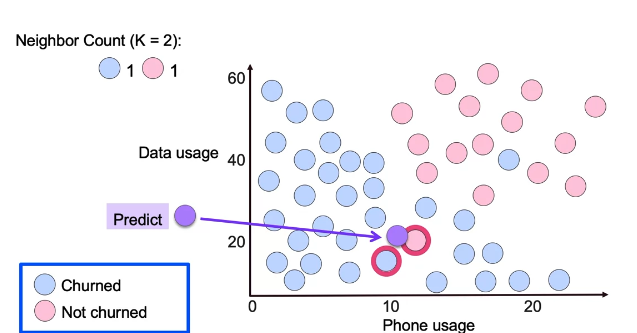

## Classification

### Logistic Regression

Performs binary classification, defined as:

$p(X) = \frac{e^{\beta_0 + \beta_1X}}{1 + e^{\beta_0 + \beta_1X}} = \frac{1}{1 - e^{\beta_0 + \beta_1X}}$

and optimizes for the correct value through maximum likelihood.

For binary data, logistic regression is able to better capture the probability of a given $X$ belonging to $1$ or $0$, based on a rounded probability value based on a threshold.

The odds of a given $X$ are computed as:

$\frac{P(X)}{1 - P(X)}$

where then that is equivalent to $e^{\beta_0 + \beta_1 X}$

$\frac{P(X)}{1 - P(X)} = e^{\beta_0 + \beta_1 X}$

$logit = log(\frac{P(X)}{1 - P(X)}) = \beta_0 + \beta_1 X$

This is also known as the logit.

This logit is then used in the logistic function as:

$p(logit) = \frac{1}{1 - e^{logit}}$

Where an increase in an $X_i$ by a given unit $n$ will increase the $logit$ by a factor of $n * \beta_i$ or increases the regular odds by a factor of $e^{\beta_i}$.

While the increase in the $logit$ might appear to be linear, the characteristic of the logistic sigmoid function as $\frac{1}{1 - e^{z}}$ makes the increase in the output probability proprotionally non-linear to the input $logit$. The rate of change to the current $p(X)$ depends on the current value of $X$ as the sigmoid function is in an $S$-shaped curve.

Interpreting this can be useful for understanding how the input features of a model change a specific outcome.

Non-linear models, as linear regression, can then be modeled through a *likelihood function*, where the coefficients $\beta_0$ and $\beta_1$ are chosen to maximize the likelihood function.

### Multiple Logistic Regresion

Posits the same process as logistic regression with the addition of multiple feature $X$.

$p(X) = \frac{e^{\beta_0 + \beta_1X_1 + ... + \beta_nX_n}}{1 + e^{\beta_0 + \beta_1X_1 ... + \beta_nX_n}} = \frac{1}{1 - e^{\beta_0 + \beta_1X_1 + ... + \beta_nX_n}}$

### Multinomial Logistic Regression

An extension of the logistic regression function, also can be known as softmax regression,

You can train different models for each $K$ class as:

$Pr(Y = k \mid X = x) = \frac{e^{\beta_{k0} + \beta_{k1} x_1 + \ldots + \beta_{kp} x_p}}{1 + \sum_{l=1}^{K-1} e^{\beta_{l0} + \beta_{l1} x_1 + \ldots + \beta_{lp} x_p}}$

where the numerator is the total probabiity over all classes and the denominator is the probabiity for class $k$.

This then computes the probabiity of a $k$ belonging in $K$

Then you can compute the probability for a chosen reference class $K$ as:

$Pr(Y= K | X = x) = \frac{1}{1 + \sum e^{Z}}$

Then, the log odds of $k$ belonging in $K$ is defined as:

$log(\frac{Pr(Y =k|X=x)}{Pr(Y = K | X = x)})=βk_0+βk_1x_1+···+β_{kp}x_p$

In essence, the log odds is transformed into a probability through the logistic sigmoid function.

Note that the reference class is purely used to compute the log odds of $k$ compared to $K$.

The result, whether we choose another class $k$ to be $K$, of the log odds will the same no matter which $K$. 

The difference is that in when optimizing for model interpretation, the coefficients $\beta$ will differ in value, choosing different $K$ so one must be careful when interpreting the model.

### K-Nearest-Neighbors

A K-Nearest Neighbor Clasifier aims to classify a datapoint $X$ by taking a look at the labels of the nearest $K$ datapoints, to take the probability of $X$ belonging to a class $Y$.

 

 

Mathematically, can be defined as:

$Pr(Y = j | X = x_0) = \frac{1}{K} \sum_{i∈N_k} I(y_i = j)$

Where we choose the $K$ nearest neighbors, then compute through $I(y_i = j)$ the probability that a given $x_0$ belongs to a class $Y$ and average it over $K$.  

This is computed multiple times for all $j$ classes to properly estimate the probability of $x_0$ belonging to the set of $j$ classes.

This is done by comparing the amount of nearest classes to a given $x_0$. The class that has the highest amount of datapoints near to $x_0$ is then chosen as the prediction class that $x_0$ might belong to.

The KNN then classifies the test observation $x_0$ to the class with the highest probability.

If there happens to be a tie between the number of datapoints nearest to $x_0$ amongst seperate classes, an odd number $K$ can be chosen which breaks a tie in terms of binary classification, but in multi-class classification, the point that's closest to $x_0$, computed per the $L_2$ norm, can be chosen as the class which $x_0$ belongs to. 

Note that the choice of $K$ can determine if the model overfits the training set or not. 

When $K$ is a small value, the KNN is less rigid and more flexible, thereby being unable to generalize to real data, as it has more variance.

When $K$ is a large value, the KNN is more rigid and less flexible, thereby having a higher bias. 

The ***pro*** of choosing KNN as a model is it's simple to implement, adapts well to new training data, and is easy to interpret.

The ***cons*** can include

- Slow prediction, due to many distance calculations
- Generating insights into the data can be difficult as you have no parameters that tell you how much of a certain feature in $x_0$ contribute to the output $Y$ 
- Suffering from the curse of dimensionality. When adding extra dimensions to features, they tend to disproportionately skew in terms of distance. This can decorrelate a given data point form another despite belonging within the same class.

Applications have included 
- Automated web usage data mining and reocmmendation systems -- A KNN takes the web usage of a user and then builds a recommendation system using a KNN.

 
 Other notes

To implement the kd-tree,

We have to take a column of the dataset and take the median. Then we split in half based on the median. Anything lower than the median goes in one group anything higher goes into the other. This is done for each available segment until we reach a minimum which is denoted by the leaf size.

### Support Vector Machines

A linear support vector machine is a linear classifier that aims to draw a boundary between a set of datapoints, based on a linear decision boundary and "Support Vectors".

</img>

Support vectors are the margins or 'padding' that surround the linear classifier of a Support Vector Machine. 

> *Note that support vector machines can be extended to Non-Linear Support Vector Machines via the Kernel Trick.*

The goal of a support vector machine is to find the line or hyper plane of a decision boundary that best separates the classes.

> *In a 2-dimensional space, a line is suitable. In $n$ dimensional spaces, where $n > 2$, a hyperplane is needed.*

We want to find the Support Vectors which correspond to the largest gap between the decision boundary and the datapoints by minimizing the Hinge Loss.

The hinge loss is a loss function used for training classification models. 

It's made for maximum margin classifiers, meaning classifiers that aim to optimize the margin distance between classes. 

The hinge loss can be defined as:

$loss = max(0, 1 - y \cdot f(x))$

where $y$ is the true class label and $f(x)$ corresponds to a prediction from the given classifier, typically a Support Vector Machine.

Thereby, if the classifier is uncertain about the classification where $f(x) = 0$, the $loss$ value will hit exactly $1$ as:

$max(0, 1 - y \cdot 0) \rightarrow max(0, 1 - 0) \rightarrow 1$

If a given label is $1$ and the predicted class is $2$, the $loss$ value will be:

$max(0, 1 - 1 \cdot 2) \rightarrow max(0, 1-2), \rightarrow 0$

Note that 
- The hinge loss does not punish correct classifications.
- The as soon as a datapoint enters the margins defined by the support vectors the loss value begins to rise.
- For the loss value corresponding to a decision boundary, the loss hits exactly 1.

The decision boundary is defined as $w \cdot x + b = 0$.

To classify predictions, if the SVM bases it's binary classifications based on the sign of an output. 

If the prediction of an SVM $f(x)$ is $>0$, the prediction class is $+1$, while if $f(x) < 0$, the prediction class is $-1$.

The weights $w$, represent the distance of the hyperplane or decision boundary that separates the classes in $x$ as best as possible from the corresponding support vectors. They yield the coordinates of a vector orthogonal to the hyper plane.

> *Orthogonal meaning the vectors are perpendicular. 
> $w \cdot x$ if $x$ is the hyperplane, will yield $0$*

Therefore the $L_2$ norm of $w$, as $||w||$, will yield the distance between the decision boundary and it's corresponding Support Vectors.

If we have $w$ as:

$w = \begin{pmatrix} 3 \\ 0 \end{pmatrix}$

and $x$ as:

$x = \begin{pmatrix} 6 \\ 4 \end{pmatrix}$

then within the equation of an SVM as $w \cdot x + b$, the dot product of $w$ and $x$ yields $18$.

Assuming that $b$ is $0$, the prediction of the SVM is $18$. Thereby, given that the prediction is positive, the class predicted is $+1$.

The margin between the optimal line or decision boundary and a given datapoint is called the geometric margin, computed as the Euclidean Distance defined as:

$\gamma = \frac{y_i(w^Tx_i + b)}{||w||}$

where the numerator represents the predicted vector derived from the boundary $w$, inputs $x$, and bias $b$.

The denominator scales the input down based on the euclidean norm of $w$ or the distance from the decision boundary to the Support Vectors. This makes sure that when computing the geometric mean, the input $x$ is independent to scaling by $w$.

A support vector machine can be sensitive to outliers, where if a single datapoint of a different class is grouped near to datapoints of different classes, then the decision boundary and support vectors will skew, indicating a level of overfitting.

Thereby, we can rely on Regularization for SVMs, similar to L2 Regularization where we add an additional loss penalty to the hinge loss.

Regularization in SVMs allows for the decision boundary and the corresponding support vectors to become non-complex, where the decision boundary doesn't overfit to nuanced features, and rather generalizes.

Similar to L2 Regularization or L1 Regularization, we add a penalty term to the hinge loss of an SVM.

$L_{regularized} = SVMCost(\beta_i) + C ||\beta||$

where $C$ is the tunable hyperparameter denoting the level of regularization we want.

If $C$ is a large value, the regularization onto the model will be higher. 
If $C$ is a small value, the regularization onto the model will be smaller.

Note that if the hinge loss is smaller, the penalty term will be higher. Inversely, if the hinge loss is higher, the penalty term would be smaller.

This is as the smaller the hinge loss is, the more complex the coefficients $\beta_i$ are, thereby indicating that they might hold a higher value. 

Therefore, the calculation of the magnitude of $\beta_i$, as $||\beta||$, will be higher the lower the hinge loss is.

#### Other

We can compute the functional margin as $y(wx + b)$. Thereby, we can then compute the support vectors as the vectors with the shortest functional margin. We can then compute the geometric distance of the support vectors as their euclidean distance from the margin boundary.

### Decision Trees

Decision Trees are a type of model that makes use of binary or multiway decisions to converge on a decision that's optimal for the given situation.

Given a datapoint, at each node of a decision tree, there must be a binary or multiway decision path where the tree splits off into other nodes or perhaps leaves that represent a final decision.

The depth of a decision tree defines the length of the longest path from the root node to a leaf node.

- A shallow tree might under-fit data.
- A deep tree might over-fit the data.

The root node is the first node while the leaf nodes represent the final decision or output. The internal decision nodes are the intermediary nodes that represent intermediary decisions between a root node and a leaf node. Branches are what connects the nodes.

The decision tree continues to split until a node is ***pure***, meaning one class remains, a ***maximum depth*** is reached, a ***minimum sample size*** is reached, or a ***performance metric***, say Entropy, is achieved.

There are different types of splitting criteria for a decision tree, such as the Gini Impurity or Entropy

Greedy Search can be used to find the optimal decision path for a tree, based on the maximum information gained from the split.

Decision Trees can tend to have high variance and overfit, given that it's non-parametric and is very flexible. 

The solution to this is to prune the tree perhaps via maximum depth or a performance metric such as classification error or information gain.

Benefits of decision trees include the absence of a need for pre-processing and being able to handle all types of data.

**Gini Impurity**

The splitting criteria for the original CART decision tree algorithm.

It's used to quantify the impurity or disorder of a set of elements.

It is defined as:

$G = \sum_{i = 1}^K p_i(1 - p_i)$

which can be simplified to:

$G = 1 - \sum_{i = 1}^K p_i^2$

where it's interval is in the range $[0, .5]$ and $p_i$ is the probability of an item being classified into class $i$

while for binary classification, it is defined as:

$G = p_1 ( 1 - p_1) + p_2(1-p_2)$

Say for binary classification, when a Decision Tree reaches it's leaf node, outputting a probability of $1$ for a choice, the Gini Index will be $0$ as:

$G = 0( 1 - 0) + 1(1-1) = 0$

Inversely, when the probability is $.5$ for the given choices, the Gini index will be $.5$ as:

$G = .5( 1 - .5) + .5(1-.5) = .25 + . 25$

When the Gini Index reaches $0$, a decision tree is essentially reached the leaf node and is sure of the decision it'd make based on the training data.

**Entropy**

Entropy is the measure of uncertainty or probabilistic disorder in a system, given probabilities $p_i$, where $i$ is a given class.[^1]

$Entropy = - \sum_{i = 1}^K p_i log(p_i)$

Given a 2 class problem where $K = 2$, it can be defined as:

$Entropy = - \sum_{i = 1}^K p_1 log(p_1) + (1 - p_2) log(1 - p_2)$

The bounds of entropy are $[0, 1]$.

**Information Gain**

Information Gain is a metric that denotes the amount of useful information that a given feature yields, to reduce the uncertainty or information entropy in a given scenario.

It can be computed as:

$IG(D, A) = H(D) - H(D, A)$, where $D$ is a dataset and $A$ is a specific feature.

- $H(D)$ is the entropy of a dataset as, $- \sum_{i = 1}^K p_i log(p_i)$, applied prior to using features to split a dataset.

- $H(D, A)$ is the weighted entropy of the subsets of the original $D$ as $\sum_{j=1}^n\frac{D_j}{|D|}H(D_j)$ where $n$ is the number of total subsets and $D_j$ is the number of total instances in the given subset. $H(D_j)$ is then the entropy of the given $D_j$. 

The subtraction, then yields the ***information gain***, which then denotes how much each additional feature or in the context of decision trees, how much each node contributed to reducing the amount of disorder or uncertainty in the given problem.

The information gain, at a given split of a tree, serves as an indicator to which feature can be the most important to consider at a given split. When splitting the root node, the first split is done on the most important feature to split upon, denoted by the highest information gain.

You can also regularize a decision tree, by adding an additional hyperparameter typically denoted as $\alpha$ or $cp$ (complexity parameter). This acts as a means of adding a penalty to the weighted entropy such that the information gain becomes negative. Given this, for some nodes there will be an information gain that doesn't prove to be optimal for the baseline split, thereby will split to an empty leaf node.

This is a form of pruning.

> *Check out the comments under the [implementation](Decision-Trees/dtree.py)*

### Ensemble Methods

Ensemble learning is a form of learning where we combing multiple models, more commonly Decision Trees to make more generalizable predictions through Majority Voting Classifiers or Soft Voting Classifiers.

**Majority Voting Classifiers** are Classifiers that leverage majority voting to make a final prediction are a form of Ensemble Learning. 

Majority voting classifiers are made up of multiple distinct classifiers, say $f_i$ where $i$ is the $ith$ classifier.

All $i$ classifiers are trained on the same data, to then make a final prediction of $\hat{y}_i$.

For every $\hat{y}_i$ that is made, the majority or the $mode()$ of all predictions is taken to find the majority vote, which is then set as the final prediction, $\hat{Y}$.

We use majority voting to mitigate the impact of that Irreducible Error has per each individual classifier $f_i$. If the Irreducible Error is uncorrelated amongst all $i$ models, taking the $mode()$ of all $\hat{y}_i$ can potentially yield a more accurate $\hat{Y}$.

The error for an ensemble model can then be computed using the Binomial Theorem, as:

$\epsilon_{ens}= \sum_{k = 0}^n \begin{pmatrix}n \\ k \end{pmatrix} (1 - \epsilon)^{n - k} \epsilon^k$

where $\epsilon_{ens}$ is the irreducible error a sum of the binomial probability over all $n$ models and $k$ are the amount of models that predict the sample label.

**Soft Voting Classifiers** are n extension of Majority Voting Classifiers, but where instead of computing the hard majority, we compute the soft majority, based on the output probabilities of a decision tree to a given class.

For each model $f_i$, rather than outputting the raw label as a prediction, it would output the probability of a label $Y$ belonging to a sample $X$.

This probability would then be used to compute an average probability of a given $X$ belong to $Y$, for all classes in $Y$ using a weight $w_i$ which is typically the same across all predictions as $\frac{1}{n}$ where $n$ is the total number of models.

The final probability is then computed as:

$\hat{Y} = argmax(\sum_{i = 0}^n w_i \cdot p_{ij})$

> *Here, if we have a given classifier with a higher reliability, we can increase the prominence of it's classification by increasing the magnitude of it's corresponding weight.*
> 
> *Then, the classifier has more of a say into which is the right prediction within the overarching ensemble*
> 
> *Finding these weights might prove to be tedious, it's a form of hyperparameter tuning. You might be able to do a grid / random search.*

Then, the class belonging to the highest probability is chosen as the class prediction.

**Bagging**, also known as bootstrap aggregating, is an Ensemble Learning method, that uses the same learning algorithm for all $n$ models within the Ensemble.

It uses $n$ Bootstrap Samples to train $n$ total models.

Then, from each prediction from a given model, $f_i$, you can use the hard majority vote or the soft majority vote from Majority Voting Classifiers and Soft Voting Classifiers respectively, to compute the final prediction for the ensemble.

Given this, in Bagging, it is practical to overfit numerous models on different sets of Bootstrap Samples, and then take the $argmax()$ of a set of averaged probabilities for a set of classes to get a more precise prediction.

> *Bagging is more geared for decision trees, so if you train multiple decision trees without pruning on different Bootstrap Samples, to overfit, and then take the hard or soft majority you'd hypothetically get a higher accuracy.*

If the error of a model is computed as:

$Error = Var + Bias + \epsilon$, where $\epsilon$ is the irreducible error, the goal of bagging is to reduce $Var$.

If $Var = (h_D(x) - \bar{h(x)})^2$, meaning $\sigma^2$, our goal would be to reduce $h_D(x) - \bar{h(x)})^2$. Reducing it would mean that we're introducing a more generalizable model to solve different problems.

>*Simple bias / variance problem, where we want to reduce variability but also mitigate the bias as much as possible, for both accuracy and generalizability.*

**Weak Law of Large Numbers (WLLN)** states that for a sequence of i.i.d (independent and identically distributed) random variables, say $x_i$, with a common mean, $\bar{x}$, we have $\frac{1}{m}\sum_{i=1}^m x_i \rightarrow \bar{x} as m \rightarrow \infty$

So for a hypothetically infinite set of i.i.d datapoints, $x_i$'s, the average of it will return to the same $\bar{x}$

If the **WLLN** is applied to classifiers, a set of bagged classifiers, where the output of an individual classifier $f_i$ is $\hat{y}_i$, then the more classifiers we have, the more representative the averaged output, as $\bar{\hat{y}}$, will be to the true label $y$.

This average of multiple classifiers is an **ensemble** of classifiers, which reduces the $h_D(x) - \bar{h(x)}^2$ or the $Var$ of the model output. This can be drawn from drawing multiple bootstrapped datsets, $d_i$ from the overarching dataset $D$.

So say we have the datsaet $D$ and we want to draw subsets of the data, $d_i$, from $D$, uniformly. The probability distribution that a given $(x_i, y_i)$ be chosen from $D$ can then be denoted as $Q(X, Y) | D)$, where the probability of choosing a given $(x_i, y_i)$ pair is $Q((x_i, y_i) | D) = \frac{1}{n}$ for all $(x_i, y_i) \in D$, where $n$ is equal to the size of $D$.

> *Each sample has an equivalent probability of being chosen for the given subset of $D$, $d_i$*
> *Note that each sample can be chosen more than once, as for each draw, we're drawing from the entire dataset $D$. This is called drawing with replacement.*

Then, the bagged classifier can be denoted as $\hat{h}_D = \frac{1}{m} \sum_{i = 1}^{m} h_{d_i}$, where $\hat{h}_D$ is the output of the bagged ensemble, $d_i$ si the subset of samples, $m$ is the total amount of  classifiers, in the bagged ensemble.

> *Note that the **WLNN** does not apply to a bagged classifiers as the subsets, $d_i$ are drawn from $D$ in a manner that doesn't allow for every $d_i$ to be i.i.d as multiple samples can repeat and be dependent. But this does not disrupt the classifier as it still tends to be more empirically accurate than standalone decision trees.*

An advantage of a bagged classifier is that it can provide us with an out-of-the-box test error. Given that some $d_i$ won't include some $(x_i, y_i)$, there will be a set of classifiers, $h$, within the total set $H$, that were never trained on $(x_i, y_i)$

Therefore, what one can do is identify the classifiers that weren't trained on $(x_i, y_i)$, and run a prediction using the $(x_i, y_i$ for that given subset of classifiers. This is run for all classifiers within an ensemble that weren't trained on a given $(x_i, y_i)$ and then ran for all possible sets of $(x_i, y_i)$. The subset of classifiers will differ for each $(x_i, y_i)$. Then the error is averaged amongst all classifiers.

$E = \frac{1}{n} \sum_{(x_i, y_i) \in D} e$

This can then give us an insight on what the true test error would be if the model was implemented on a real-world dataset, without having access to one.

We can also obtain the $\mu$ and the $Var$ for the entire set of classifiers, the $\mu$ being the prediction of the ensemble baesd on soft or hard majority voting and the $Var$ being the level of uncertainty, of the predictions of the model.

**Random forests** are a set of bagged decision trees, with the addition of some extra randomness to each tree.

Rather than only using Bootstrap Samples, a random forest has it's individual bagged decision trees trained on a random subset of features.

If we have $n$ total features, we choose $k$ features randomly at each node, where $k < n$, limiting a decision tree to choose the optimal feature split index from only the subset of features, $k$.

Then per usual, you'd choose the split with the highest Information Gain through the Gini Index or Entropy, to make the next split, but only based on $k$.

A typical choice of the size of $k$ is $k_{size} = \sqrt{n}$

This is done to decorrelate each tree within the ensemble, to further reduce the variance and mitigate overfitting. 

> *Otherwise, an individual tree in the ensemble might still come up with similar splits to others.*

If we had a dataset $D$, containing multiple $D_i$, where $D_1$ was a very strong feature / predictor for a given label, most trees if not all would then use $D_1$ at the first split, the root split. Thereby most of the trees may end up looking very alike given that the strongly correlated feature was used as the root split node for all.
So each tree is correlated. Random forests overcome this as they're limited to using a subset of the total features / predictors and therefore, most of the trees in the random forest ensemble, won't have a predictor that strongly correlates the trees.

The smaller the size of the subset $D_1$ is, the better the tree will be at generalizing to a dataset to provide an unbiased prediction, as the predictions are based on trees using different sets of predictors.

The process of training a Random Forest is very similar to training a set of bagged trees, the only difference being that we select different $n$ subsets of bootstrapped samples containing different $m$ features $\in D$, $D_i$, to train $n$ different models.

1. Sample $n$ datasets from $D$ with replacement (bootstrapped samples)
2. For each subset, $D_i$, select a random number of features at each node, $m$, to train a decision tree on and leave out the rest, where $m ≤ len(D_i)$
3. Train the ensemble on each $D_i$, and then run predictions
4. Get the final predictions using hard or soft majority voting.

## Boosting 

### Adaboost

Boosting adds a set of weights, to a given set of samples, to iteratively train a set of ensembled trees, allowing them to pay more attention to classes that they've incorrectly classify in previous iterations.

Given a set of training examples, you

1. Train a weak learner, meaning a model that is only slightly better than random guessing.
2. Identify the misclassified and correctly classified classes. 
3. Increase the weights for the samples in the misclassified class (can be done via increaisng probability of drawing a class in bootstrapping)
4. Retrain the model on the new set of samples.
5. For a final prediction, run a pass through all the weak learners and 

Say we have a boosted classifier:
$H(\vec{x}) = \sum_{i=1}^T \alpha_t h_t(\vec{x})$

$h_t$ is an instance of a **weak learner**, a model / algorithm that is not good at classifying predictions.

This is typically a tree stump, a decision tree that has a depth $< 1$.

The weak learner, $h_t$, is trained on a given dataset, only allowed to reach $depth = 1$. The total error for the stump is the $\sum_{i:h(x_i)≠y_i} w_i$, where $w_i$ is the $ith$ weight associated with the $ith$ classifier that provided an incorrect prediction.

This total error will always be within the range $[0, 1]$, as the weights are always normalized to sum up to $1$.

This total error ($\epsilon$) will determine the amount of say or contribution, $\alpha$, that a model has on the final output of the ensemble.

The $\alpha$ is computed as:

$\alpha = \frac{1}{2} ln(\frac{1 - \epsilon}{\epsilon})$

When the total error is small, the amount of say will be large and positive. Otherwise it will be a large negative value.

Then, if $\alpha$ is a negative value, the learner's predictions are incorrect and what would've been, for example, a prediction of $1$ for a positive value, will be turnt into a value representing the opposite class, typically $-1$ or $0$.

As an example, if the total error was defined as $\frac{3}{8}$ or $.625$, the amount of say would be calculated as:

$\alpha = ln (\frac{(1-.625)}{.625}) * (\frac{1}{2})$

For every incorrect mapping that each $h_t$ applies on $\vec{x} \rightarrow \vec{y}$, where $\vec{y}$ are the true labels, you take the initial weak learner $h_1$, and iteratively update the weights on the set of samples, such that the learner $h_1$ pays more attention to the weighted samples at it's second iteration. 

Once the loss function is computed, the weight update can be computed as:

$w \leftarrow w(e^{-\vec{\alpha} \vec{h(x_i)}y_i})$

*This equation can be eperated into 2 equations as:*

*If correct: $w \leftarrow w(e^{-\vec{\alpha}})$*  
*Else: $w \leftarrow w(e^{\vec{\alpha}})$*

*The first more explicitly computes the full weight increase / decrease operation in a single equation while the latter does it seperately.*

where $y_i$ is the true label for the training sample $x_i$ and $\alpha$ is the amount of say that each ensemble, $\vec{h(x_i)}$ is the label prediction from the weak learners.

Then the weights, $w$, are normalized such that the sum of all weights $w$ add up to $1$. 

This can be done by: 

$w_{sum} = \sum w$  
$w_{normalized} = \frac{w}{w_{sum}}$  
$w \leftarrow w_{normalized}$

We can now compute the loss (error metric) of the entire model as:

$l = \sum_{i=1}^ne^{-yh(x_i)_i}$

O
Then we train another instance of the algorithm, $h_2$, applying the weights $w$. This can be done via weighted bootstrapping or a weighted gini index / entropy.

- The weighted gini index would look as $1 - \sum w^2$, replacing $w$ with the original probability $p$.
- Taking a new dataset, based on weighted bootstrapping, would just increase the probability that a given sample is drawn based on the weights. You draw a new dataset baesd on the weights, but then reset the weights each time, allowing the weak learner to generate new weights on the weighted boostrapped dataset.

The final model consists of all weak learners, with the updated weights, attained at the final iteration of the training. 

Each weak learner then makes a final prediction, based on their amount of say, contributing to the final ensemble as:

$H(\vec{x}) = \sum\alpha h(\vec{t})$

If $H(\vec{x}) > 0$, the sample is classified as $1$, otherwise the sample is classified as $0$ or $-1$, depending on what the opposing label is identified as.

### Gradient Boosting

Gradient boosting is analogous to AdaBoost, but it's specifics differ.

- It fits decision trees sequentially to the errors of previous trees
- Each tree that is fit is deeper than the previous tree, fitting weak learners to reach a strong learner
- It's loss function is differentiable, allowing us to compute gradients to train each subsequent tree.

1. First, you construct a base tree (the root node)
2. Compute the errors and predictions for the current tree.
3. Then you build a new tree based on the errors of the current tree.
4. You combine the current tree and the new tree and then repeat fom step $2$.

**Regression**

Say we denote our classifiers as $h_i$ where $i$ is the $ith$ classifier.

For the root node, given a training set $X$ and labels $Y$, the prediction is based upon the average of $Y$:

$\hat{Y} = \frac{\sum_{i=1}^n y_i}{n}$

You can compute the loss as the mean squared error (mse).

$mse = \frac{1}{n} \sum_{i = 1}^{n} y - \hat{y_i}$

Then we build the next tree based on the errors of the previous tree, in this case, a root node.

First compute the residuals:

$R = Y - \hat{Y}$

and then train a new tree to fit on these residuals rather than the labels. $r_i$ is the new $y_i$.

> *Note that regression trees are fit and their nodes are split, based on the Mean Squared Error or Mean Absolute Error.*

For each leaf node in a new tree, the value at the leaf node (label for a correpsonding sample) is the new residual $r$. 

If a tree has multiple values at a leaf node, then the residual is the average of all the values. The samples at the given leaf node with non-unique values, then have their residuals assigned as that same average value. Both samples would get transfered the same residual via a weighted sum (below).

So to transfer the new residuals, to the previous, you can take a weighted sum of the previous residuals with the new residuals as:

$R = R^{t-1}  + \alpha R^t$

where the residuals, $R$, becoems the predictions of the current tree.

$\hat{Y} = R$

where $\alpha$ is defined as the learning rate.

Then essentially, the process at each step is:

$\hat{Y} = \frac{1}{n} \sum_{i = 1}^{N} L(y_i, h(x_i + \hat{y}_{t-1}))$

$h_t(x) = h_{t-1}(x) + \alpha\sum\hat{Y}$

$repeat \hspace{1mm} t \hspace{1mm} times$

> We're trying to get the prediction that minimizing the value of the loss function, based on labels Y and the predictions of the algorithm.

**Classification**

For classification, the process is similar, with some subtle differences:

For the root node, the prediction is based on the log odds of $Y$. Say the prediction is $\hat{Y}$.

$\hat{Y}_{raw} = \log(\frac{p}{1-p})$

where $p$ is the probability of a given $Y$.

Then, $\hat{Y}_{raw}$ becomes the initial value for the initial tree's leaf nodes.

Then you transform it into a probability, using the sigmoid $(\sigma)$ or softmax function, commonly used in neural networks, depending if you're doing binary or multiclass classification:

$Sigmoid = \frac{1}{1 + e^{-z}} = \hat{Y}$ where $z = \hat{Y}_{raw}$ 

$Softmax = \frac{e^{z_k}}{\sum_j e^{z_j}} = \hat{Y}_k$ where $z = \hat{Y}_{raw}$ 

You can then compute the loss using the categorical cross-entropy loss:

$L = - \sum_k Y_k \log(\hat{Y}_k)$, for softmax (multiclass)

$L = - \sum [Y \log(\hat{Y}) + (1 - Y) \log(1-\hat{Y})]$ for sigmoid (binary)

You then compute the residual / gradient of the loss with respect to the prediction:

For binary classification:
$R = Y - \sigma(\hat{Y}_{raw})$

For multiclass classification:
$R_k = Y_k - \frac{e^{\hat{Y}_{raw,k}}}{\sum_j e^{\hat{Y}_{raw,j}}}$

These residuals will then be used to grow the next tree.

We can directly use these residuals to fit the next tree, as they represent the direction and magnitude of change needed in the log-odds space.

We update the boosted ensemble as:

$\hat{Y}_{raw} = \hat{Y}_{raw}^{t-1} + \alpha \cdot h_t(x)$

where $\alpha$ is a learning rate and $h_t(x)$ is the prediction of the new tree, with respect to the residuals.

This process is repeated for a specified number of iterations or until a stopping criterion is met.

The final prediction is obtained by transforming the final $\hat{Y}_{raw}$ to probabilities using sigmoid or softmax functions. 

In softmax, for a given class, the label with the highest probability is the assigned class for the sample
In sigmoid, if the output is above $.5$, then the class is $1$, otherwise it is $0$