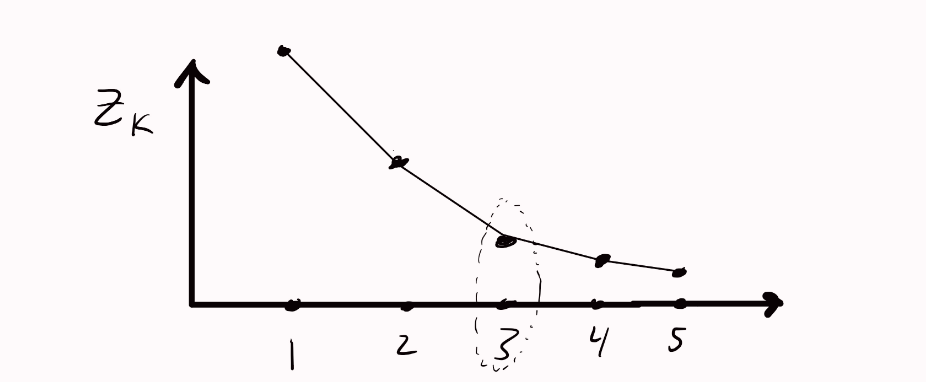

# Clustering

Clustering is a means to categorize unlabeled data in specific clusters, where each cluster has as unique identifier, akin to a class label.
Clustering helps differentiate amongst different datapoints when they are unlabeled based on a similarity metric.

In certain cases, obtaining labeled data can be very expensive especially when you're working in a deep scientific field and need domain experts to properly label your data.

> *Example; Labeling brain tumor samples*

Clustering can instead get the unlabeled data and group them together based on similarity metrics which can make classifying a set of datapoints easier.

The output of a given clustering algorithm will be the assignment of each datapoint in a sample set, $X$, to a given cluster.

Many clustering algorithms have a runtime complexity of $O(n^2)$, as they compare a given datapoint, $n_i$, to all other datapoints, $n_j$, $n-1$ times.

$O(n^2) = \frac{n(n - 1)}{2}$

If I have $4$ datapoints, meaning $n = 4 \rightarrow O(4^2)$ as we compare each point with each and every point.

Dataset: $1, 2, 3, 4$

$(1, 2), (1, 3,), (1, 4), (2, 3), (2, 4), (3, 4)$, we have $6$ total unique comparisons.

While if we have $5$ datapoints, meaning $n = 5 \rightarrow O(5^2)$:

Dataset: $1, 2, 3, 4, 5$

$(1, 2), (1, 3,), (1, 4), (1, 5) (2, 3), (2, 4), (2, 5), (3, 4), (3, 5), (4, 5)$, we have 10 total unique comparisons.

The # of unique comparisions increasing by $4$.

If we add another $n$, such that $n = 6$, the # of unique comparisons would then scale to $15$. The growth of unique comparisions begins to scale at an accelerated rate, increasing faster as $n$ grows. 

In practice, clustering algorithms that have $O(n^2)$ complexity aren't ideal to use as $n$ grows.

### Centroid Based Clustering

A centroid is the mean ($\mu$) of a given cluster. It's essentially the point that is closest to all other points in a clluster.

Centroid based clustering organizes unlabeled data into non-hierarchical clusters. It's goal is to make every point $x_i$ as close as possible to a centroid, $k_j$. It's efficient but sensitive to initial conditions of their centroids and outliers that may skew the centroids.

> *Centroids are defined as the arithmetic mean of a given cluster*

### Density Based Clustering

Density based clustering clusters areas of with high sample density. 

This allows for discovering any amount of clusters of any shape, based on the hyperparameters:

- $\epsilon$, denoting the maximum distance between two points, for them to be considered neighbors, to form a cluster.
- MinPoints, denoting the minimum number of points in a neighborhood required to form a cluster.

### Distribution Based Clustering

This assumes that data, belonging to a given class, is probabilistic and can be represented by a $PDF$ such as a Gaussian Distribution.

For a given cluster, as a datapoint distances itself away from the center of the cluster, the probability that the datapoint belongs to the cluster decreases. The inverse is true.

### Hierarchical Based Clustering

Hierarchical Based Clustering creates a tree of clusters, where each cluster is a sub component, nested under another cluster.

It clusters based on measuring the dissimilarity of datapoints at a given node.

It's better well suited for hierarchical data such as a taxonomies.

## K-Means Clustering

Notation:

- $C_j$ is the $jth$ cluster
- $k$ is the total number of clusters
- $\mu_j$ is the $jth$ centroid
- $t$ is the current iteration. $T$ is the total number of iterations.

K-Means is a form of centroid based clustering where the algorithm, $\mathbb{A}$, aims to cluster the algorithm based on iteratively adjusting centroids by recomputing their arithmetic mean for each cluster at each iteration.

K-Means has a complexity of $O(n \cdot K \cdot T \cdot d)$ where:

- $n$ is the number of samples.
- $K$ is the total number of clusters / centroids.
- $T$ is the number of iterations.
- $d$ is the number of features.

Each cluster $k$ where $k \in [1, ..., K]$ is represented by a centroid which is the arithmetic mean, $\mu$, of all datapoints associated with the $kth$ cluster, where $\mu$ is $\in \mathbb{R}^d$, where $d$ is the dimensionality of the vectorspace we're operating in. 

### Alg, $\mathbb{A}$

You want each $x_i$ to be as close as possible to a given assigned centroid, $\mu_j$, which is done by $min(WCSS)$ where $WCSS = \sum_{j=1}^k \sum_{x_{i}\in C_{j}} ||x_i - \mu_j||^2$ and $\mu_j$ is the mean of the dataset $X$ in the $jth$ cluster.

The function, $WCSS$ essentially computes the euclidean distance between all $i$ datapoints ($x_i$) in the $kth$ cluster, $C_j$, and the centroid ($\mu_j$) for the given cluster ($C_j$).

We want to minimize this value, as doing so would give us the optimal centroids wehre $x_i$ is as close as possible to it's assigned centroid.

We don't know the values of the centroids prior to the algorithm, so we can randomly initialize them to some random variable in the $\mathbb{R}^d$ space, if we're not using k-means++.

Say we chose $k$ total clusters.

We assign all $x_i$ datapoints in $X$ to their nearest centroid, $\mu_j$, based on the euclidean distance.

All $x_i$ datapoints assigned to the nearest $\mu_j$ are given the label id, $z$.

From there on, we can compute the distances of each point with the centroid, as $||x_i - \mu_j||^2$ to then compute the loss as a metric for the algorithm.

Afterward, we reassign the value of the centroid $\mu_j^{t+1}$ to the mean of all $i$ datapoints that are attached to the current centroid ($\mu_j$) / cluster ($C_j$) via the assigned label id, $z$.

> *t is the current iteration*

And then compute the loss once more.

Over time, as this goes on for multiple iterations, $\mathbb{A}$ will eventually find the optimum values of the centroids that minimize the distance of each $x_i$ from their assigned $C_j$.

### Dealing with variability in $\mu$

The k-means algorithm isn't guaranteed to find a global optima, there's a significant chance that it'll find a local minima instead

Over multiple runs of $\mathbb{A}$, there will likely be different results for different initializations of clusters, and therefore different values of $WCSS$. Then, we don't really know what the optimal positions of $\mu$ that identify clusters ($C$) and the label ids ($z$) are.

A simple way to solve this is to brute force a search for $k$ multiple times, by attempting multiple random initializations of clusters and take the output that minimizes the $WCSS$.

Another way to do so is to use k-means++ which aims to initialize each $\mu$ such that they are as evenly spread out as possible from each other. 

This consists of:

1. Randomly initialize a first centroid, $\mu_1$, drawn uniformly.
   1. Say we add $\mu_1$ to set $M$
2. Compute all distances between all $x_i$ and the centroid $\mu_1$.
3. Compute a probability that a given $x_i$ will be a centroid, based on the euclidean distance as $P(x_i) = \frac{D(x_i)^2}{\sum_{x \notin M}D(x)^2}$ where $D()$ is the function that computes the euclidean distance for a given $x_i$ to it's nearest centroid, $\mu_i$.
4. Choose a centroid, drawn randomly via weighted probabilities yielded by $P(x_i)$
5. Repeat for all $k$ centroids.[^4]

### Choosing a value for $K$[^3]

We can use the $WCSS$ as a measure for choosing the optimal value of $K$, but we don't choose a $K$ that yields the lowest $WCSS$, otherwise it'd be obvious to cheat and pick $K$ to be equivalent to $len(X)$.

What can be done instead is to look for the $K$ where $Z_k$ stops decreasing quickly or at the *elbow* of a plotted $K$ and $Z_k$.

</img> 

 

This indicates that the algorithm has already captured the key clusters of a given $X$. While it may be possible to divide further, doing so might lead to an erroneous result. It's more uncertain than not.

A more rigorous means to choose the right $K$ is to compute what's called a Gap Statistic, which compares the clustering results on the observed data with those on a uniformly distributed reference dataset.

For each value of $k$, we can compute the final $WCSS$ for $X$ after 'convergence', alongside the $WCSS$ for a synthetic dataset, $X_{u}$.

Here, $X_{u}$ is a dataset of same size as $X$ but with it's features randomly drawn from a uniform distribution, that's within the same range as the features of $X$.

Afterward, we can compute the gap statistic as:

$Gap = \frac{1}{b} \sum_{b=1}^B log(WCSS_b) - log(WCSS_k)$

where $B$ is the total amount of synthetic datasets we use. Typically $B$ is a value $\in [10, ..., 500]$ depending on the amount of computational resources and complexity of the problem.

Ultimately, the goal is to $argmax(Gap)$, where the $k$ with the corresponding maximum is the optimal value for the amount of $k$ clusters.

Of course, given that we initialize $k$ centroids ($\mu$) randomly, it's very likely that we'll get inconsistent values for a gap statistic if run multiple times for the same $k$. Instead, we can run $\mathbb{A}$ multiple times on the same number of $k$ centroids and then average the multiple returns of $WCSS$ over the total number of runs, to then get an average gap statistic for a given $k$.

**Weaknesses of K-Means:**

- No guarantee for the global minima, even with k-means++
- Assumes a linear boundary, may be unsuitable for datasets that aren't clearly seperable (instead use Kernel Trick).
- Imbalanced datasets / densities of classes
- Samples of same class aren't geometrically clustered into the same space in $\mathbb{R}^d$, they aren't isotrophic.

**TLDR:**

1. Choose the number of clusters, $k$ (hyperparamter, randomly or via *k-means++*)
2. Randomly choose $k$ centroids, $C$
3. Based on the euclidean distance, assign each point ($x_i$) to the nearest $k_i$ centroid and give each $x_i$ a label id, $z$.
4. For each given cluster, reassign the centroid by taking the arithmetic mean of all points in the cluster or the points that have the same label id, $z$ (same thing, $z$ is just how you identify them).
5. Reassign each point to the nearest centroid via the euclidean distance.
6. Repeat until no points change clusters and the $WCSS$ is minimized

[^3]: but if the position of the clusters differs per iteration, how would we know which k is optimal? wouldn't metrics be inconsistent?

# Hierarchical Clustering

Won't be covering Hierarchical Clustering as it isn't near relevant to Deep Learning as K-Means is. I'm optimizing for deep learning.
But here are some useful resources:

https://www.cs.princeton.edu/courses/archive/fall18/cos324/files/hierarchical-clustering.pdf

https://www.econ.upf.edu/~michael/stanford/maeb7.pdf

https://www.youtube.com/watch?v=esmzYhuFnds&t=2197s

https://en.wikipedia.org/wiki/Hierarchical_clustering

Also checkout introduction to statistical learning.

#### Other Useful Resources:

[Video on K-means by Stanford CS221](https://www.youtube.com/watch?v=5-Fn8R9fH7A)

[Handout on K-Means by Stanford CS221](https://stanford.edu/~cpiech/cs221/handouts/kmeans.html)

[K-means by Cornell CS4/5780](https://www.cs.cornell.edu/courses/cs4780/2022sp/notes/LectureNotes04.html)

[PDF on Hierarchical by Princeton](https://www.cs.princeton.edu/courses/archive/fall18/cos324/files/hierarchical-clustering.pdf) 
