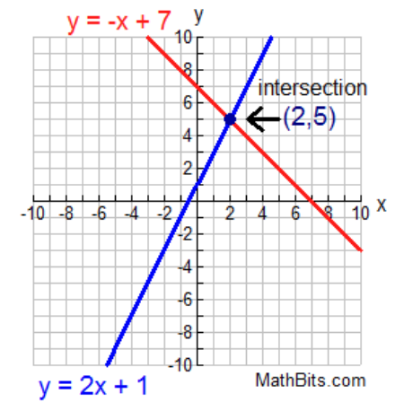
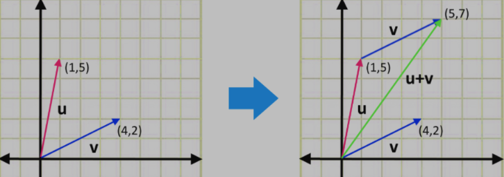

# The Geometry of Linear Equations

A dot product is a multiplication between two vectors, 

$\begin{bmatrix}a_1 \\ a_2\end{bmatrix} \cdot \begin{bmatrix}x_1, x_2\end{bmatrix} = \begin{bmatrix}a_1x_1 + a_2x_2\end{bmatrix} = C$

where each element the of the first vector is multiplied correspondingly to the elements in the second vector and then summed.

The dot product then makes up a bigger Matrix Multiplication.

A matrix multiplication is a multiplication by 2 matrices, where each row of the first matrix corresponds to the dot product of each column in the second matrix.

**Example 1**

$\begin{bmatrix}a_{11}, a_{12}\\ a_{21}, a_{22}\end{bmatrix} \cdot \begin{bmatrix} b_{11}, b_{12}\\ b_{21}, b_{22} \end{bmatrix} = C$

$C = \begin{bmatrix} a_{11} \cdot b_{11} + a_{12} \cdot b_{21} & a_{11} \cdot b_{12} + a_{12} \cdot b_{22} \\ a_{21} \cdot b_{11} + a_{22} \cdot b_{21} & a_{21} \cdot b_{12} + a_{22} \cdot b_{22} \end{bmatrix}$

$\begin{bmatrix} z_{11}, z_{12}, z_{13} \\ z_{21}, z_{22}, z_{23}\end{bmatrix} \cdot \begin{bmatrix} b_{11}, b_{12} \\ b_{21}, b_{22} \\ b_{31}, b_{32} \end{bmatrix} = C$

**Example 2**

$C = \begin{bmatrix} z_{11} \cdot b_{11} + z_{12} \cdot b_{21} + z_{13} \cdot b_{31} & z_{11} \cdot b_{12} + z_{12} \cdot b_{22} + z_{13} \cdot b_{32} \\ z_{21} \cdot b_{11} + z_{22} \cdot b_{21} + z_{23} \cdot b_{31} & z_{21} \cdot b_{12} + z_{22} \cdot b_{22} + z_{23} \cdot b_{32} \end{bmatrix}$

 

Then systems of Linear Equations are a set of equations with $n$ unknowns.

The goal of these systems of equations are to compute these $n$ unknowns by solving each equation for each unknown.

A system of linear equations is traditionally defined as:

$2x - y = 0$

$-x + 2y = 3$

where it can be solved graphically as:

</img>

while it can also be defined through matrices as:

$\begin{bmatrix} 2, -1 \\ -1, 2 \end{bmatrix} \begin{bmatrix}x \\ y \end{bmatrix} = \begin{bmatrix} 0 \\ 3 \end{bmatrix}$

where this representation is a [[Matrix Multiplication]].

It can also be defined as a linear combination (column way, per Gilbert Strang), as:

$x\begin{bmatrix} 2 \\ -1 \end{bmatrix} + y \begin{bmatrix} -1 \\ 2 \end{bmatrix} = \begin{bmatrix} 0 \\ 3 \end{bmatrix}$

which can be solved graphically as:

</img>

