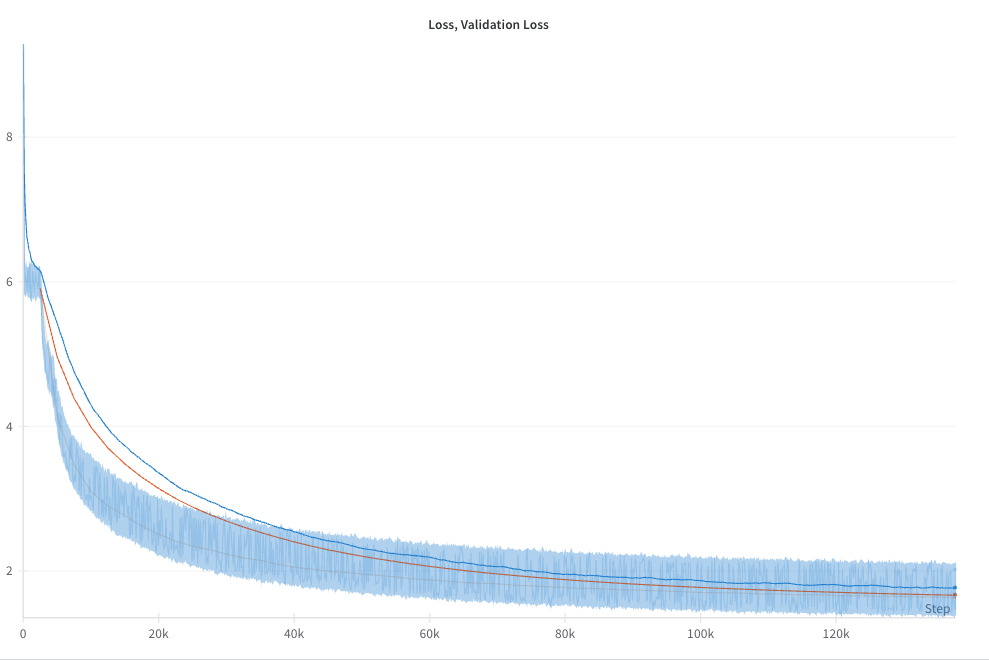

# Small Language Modelling.

This repo hosts a training framework to experiment with and train small language models using PyTorch. This repository includes training scripts, data preprocessing utilities, and model definitions.

Currently, this repo is utilizes the [TinyStories dataset](https://arxiv.org/abs/2305.07759).

( made for internal usage, therefore prone to random modifications and may be buggy, but feel free to clone. )

### Overview

**Data Preprocessing:** Scripts for processing raw data are located in the [data](data/) folder, including [preprocess.py](data/preprocess.py) and [utils.py](data/utils.py).

**Training & Generation:** The training pipeline, model building, and text generation are implemented in the [src](src/) directory. Key files include:
  - [train.py](src/train.py): Training script.
  - [model.py](src/model.py): Model definition.
  - [generate.py](src/generate.py): Text generation script.
  - [dataloader.py](src/dataloader.py): Data loading utilities.

- **Additional Utilities:**  
  Helpers and additional utilities are available in [src/utils.py](src/utils.py).

### Dependencies

- torch (2.4)
- wandb 
- tqdm 
- transformers
- tokenizers 
- pandas and pyarrow

### Usage

Out of the box, simply run:

(1) Install dependencies

```python
pip install -r requirements.txt
```

(2) Data preparation

```python
python data/preprocess.py
```

(3) Training

( default setup currently uses FSDP )

```python
torchrun --nproc-per-node=2 src/train.py
```

(5) Generation

Assumes model weights are input into the `weights/` directory.

```python
python src/generate.py
```

### Sample Training Runs

> *[WandB](https://wandb.ai/vxnuaj/SLM-35.7M-V2/runs/Official-Run-9?nw=nwuservxnuaj)* -- the block plots correspond to the gradient norms.

<div align = 'center'>

</div>
<br/>

Got down to ~1.7 loss, decided to stop early. Hypothesize that around ~1.3 would be optimal for better generation.

Sample Input:
```
Once upon a time there was a little girl named Lucy. She was very adventurous. She loved to explore the
world around her, especially when it was bright and sunny outside.
One day, while exploring the nearby park, Lucy came across a ladder leaning on a wall. She was curious
to see what’s on top, so she climbed the ladder, but when she reached the top, the ladder fell and she was
stuck.
```

Sample Output:

```
"Oh no!" she cried.

Just then, a friendly voice called out from below.

"Don't worry, Lucy," it said. "I can help you."

Lucy was so happy. She thanked the voice and ran off to find her mom.

The end.
```

Config:

```zsh
--- wandb_config.json ---
{
  "wandb_": true,
  "api_key": "adb8e27fcf9ff0f8d92bfd422ade4d77b7e5232e",
  "project": "SLM-35.7M-V2",
  "dir": "wandb_cache/",
  "id": "Official-Run-9",
  "name": "Official-Run-9"
}

--- val_dataloader_config.json ---
{
  "eval_data_path": "data/tensors/val/",
  "eval_size": 10000,
  "val_batch_size": 2000,
  "num_workers": 24,
  "shuffle": false,
  "pin_memory": true
}

--- train_config.json ---
{
  "total_epochs": 10,
  "mixed_precision": false,
  "save_checkpoint_path": "checkpoints/saved_cache/",
  "load_checkpoint_path": false,
  "save_checkpoint_steps": 2500,
  "clip_grad_norm": true,
  "max_grad_norm": 1,
  "track_grad_norm": true,
  "val_data_path": "data/tensors/val/",
  "val_steps": 2500,
  "sample_model_val": true,
  "parallel": true,
  "seed": 0,
  "batch_size": 16,
  "pad_token_id": 1,
  "run": 9
}

--- parallel_config.json ---
{
  "parallelism_type": "fsdp",
  "backend": "nccl",
  "min_num_params": "1_000_000",
  "type_": "transformer"
}

--- opt_config.json ---
{
  "lr": 0.0005,
  "betas": [
    0.9,
    0.999
  ],
  "eps": 1e-08,
  "weight_decay": 0.01
}

--- model_config.json ---
{
  "d_model": 512,
  "embed_dim": 512,
  "max_seq_len": 512,
  "dropout_p": 0.1,
  "n_heads": 8,
  "n_blocks": 4,
  "context_len": 512,
  "vocab_size": 10000,
  "pretrained_embeddings": false,
  "sliding_window": 256,
  "learned_pe": false,
  "freeze_embeddings": false
}

--- lr_config.json ---
{
  "warmup_steps": 750,
  "constant_steps": 0,
  "decay_steps": 409870,
  "max_lr": 0.0001,
  "min_lr": 1e-05
}

--- loss_config.json ---
{
  "reduction": "none",
  "ignore_index": 1
}

--- generate_val_config.json ---
{
  "eos_token": 0,
  "context_len": 512,
  "max_toks_out": 100,
  "_greedy": false,
  "top_p": 0.9,
  "top_k": null,
  "temperature": 1.0,
  "verbose": false,
  "sample_model_str": "Once upon a time, in a big forest, there lived a rhinoceros named Roxy.",
  "tokenizer_path": "data/tokenizer.json"
}

--- dataloader_config.json ---
{
  "list_": true,
  "shuffle": false,
  "train_tensor_path": "data/tensors/train",
  "verbose": true,
  "pin_memory": true,
  "num_workers": 24
}
```
